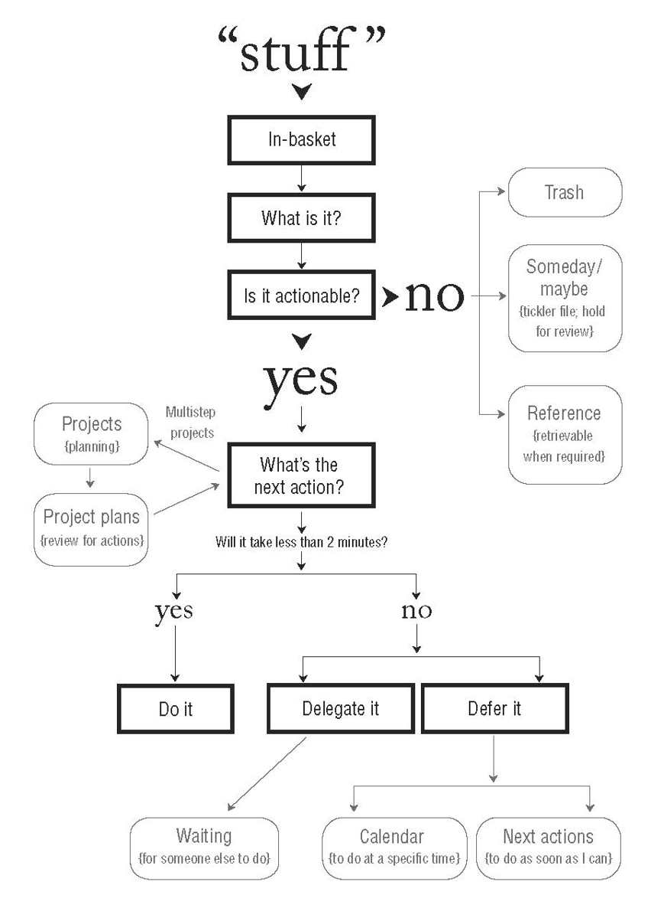

# Chapter 2: Getting Control of Your Life: The Five Steps of Mastering Workflow

We

 (1) *capture* what has our attention; 

 (2) *clarify* what each item means and what to do about it;

 (3) *organize* the results, which presents the options we

 (4) *reflect*on, which we then choose to 

 (5) *engage *with.

Most people have major weaknesses in their (1) *capture*process.

Many have collected lots of things but haven’t (2) *clarified*exactly what they represent or decided what action, if any, to take about them.

don’t efficiently (3) *organize*the results. 

- reminder

- context

- format

  Still others have good systems but don’t (4) *reflect* on the contents consistently enough to keep them functional. \

what someone is likely to choose to (5) *engage*in at any point in time may not be the best option.

## Capture

### **Gathering 100 Percent of the “Incompletes”**

Many of the things you have to do are being collected *for*you as you read this. 

As soon as you attach a “should,” “need to,” or “ought to” to an item, it becomes an incomplete. 

capture it into “containers”

### **The Capture Tools**

Physical in-tray

Paper-based note-taking devices

Digital/audio note-taking devices

E-mail and text messaging

### **The Success Factors for Capturing**

1.**Get It All Out of Your Head**

2.**Minimize the Number of Capture Locations**

3.**Empty the Capture Tools Regularly**

## Clarify

1.**What Is It?**

But we haven’t discussed what stuff is and what to do about it.

2.**Is It Actionable?**

- *No Action Required* If the answer is **no**, 

you need a wastebasket and <Del> key for trash,

a “tickler” file or calendar for material that’s incubating

a good filing system for reference information.

- *Actionable* This is the **yes**group of items,

考虑两件事

If It’s About a Project . . .*

 ->capture that outcome on a “Projects” list. ->A Weekly Review of the list->stay fresh and alive in your management system (versus your head) until it is completed

*What’s the Next Action?*

The “next action” is the next physical, visible activity that needs to be engaged in, in order to move the current reality of this thing toward completion.

*Do It, Delegate It, or Defer It* 

*1. Do it.*If an action will take less than two minutes, it should be *done*at the moment it is defined.

*2. Delegate it.*If the action will take longer than two minutes, ask yourself, Am I the right person to do this? If the answer is no, *delegate*it to the appropriate entity.

*3. Defer it,*If the action will take longer than two minutes, and you are the right person to do it, you will have to *defer*acting on it until later and track it on one or more “Next Actions” lists.

## Organize

For nonactionable items, the possible categories are 

*trash*：在Omnifocus中直接按删除

*incubation*, and （存疑惑）

*reference* （放入本地文件夹Documents（永久）\Calibre\百度网盘中）

To manage actionable things, you will need 

a *list of **projects*** （对应omni的project试图）

*storage or 

files for project plans and **materials*** （在Downloads中建立Project）

a *calendar*（对于有具体到期时间的，用Mac自带的Calendar）

a *list of reminders of **next actions***, and（Omnifocus的Tag中的Action，Tag应该划分开，让别人做的放在WaitingForTag里，自己做，时长超过2min的放在next Actions里） 

a *list of reminders of things you’re waiting for*.

When I refer to “lists,” I just mean some sort of reviewable set of reminders

All of the organizational categories need to be physically contained in some form

- **Projects**

define a project as any desired result that can be accomplished within a year that requires **more than one action step**. 

The reason for the one-year time frame is that anything you are committed to finish within that scope needs to be reviewed weekly to feel comfortable about its status. 

Another way to think of this is as a list of open loops, no matter what the size.

Projects do not initially need to be listed in any particular order

You don’t actually *do*a project; you can only do action steps *related*to it.

- **Project Support Material**

Once you have organized your project support material by theme or topic, you will probably find that it is almost identical to your reference material and could be kept in the same reference file system

## Reflect

**Critical Success Factor: The Weekly Review**

### Engage

**Three Models for Making Action Choices**

**1. The Four-Criteria Model for Choosing Actions in the Moment**

*Context*：考虑时间、地点、和工具（也就是说Next Actions 里面应该按这三个标准拆开来，所需要的时间，可以通过estimated time来实现、地点、工具）

*Time Available*：我现在有的时间

*Energy Available*：待定

*Priority*

**2. The Threefold Model for Identifying Daily Work**

Doing predefined work

Doing work as it shows up

Defining your work

**3. The Six-Level Model for Reviewing Your Own Work**

Horizon 5: Purpose and principles

Horizon 4: Vision

Horizon 3: Goals

Horizon 2: Areas of focus and accountabilities

Horizon 1: Current projects

Ground: Current actions