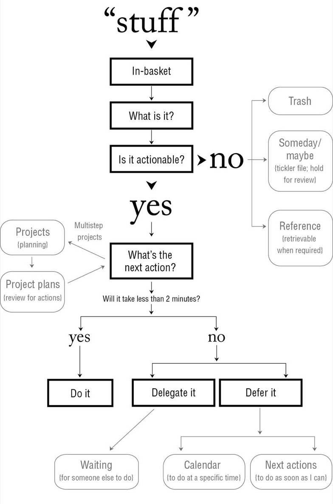

# Chapter 6: Clarifying: Getting “In” to Empty

from "in" to next action

## Processing Guidelines

- Process the top item first.
- Process one item at a time.
- Never put anything back into “in.”

## The Key Processing Question: “What’s the Next Action?”

**What If There Is No Action?**

- Trash

When in doubt, throw it out.

- Items to incubate

“There’s nothing to do on this now, but there might be later.”

two option

Write them on a Someday/Maybe list.

Put a reminder of them on your calendar or in a tickler file.

- Reference material

**And If There Is an Action . . . What Is It?**

**Once You Decide What the Action Step Is**

*Do it*(if the action takes less than two minutes).

*Delegate it*(if you’re not the most appropriate person to do the action).

*Defer it*into your organization system as an option for work to do later.

### Identifying the *Projects*You Hav