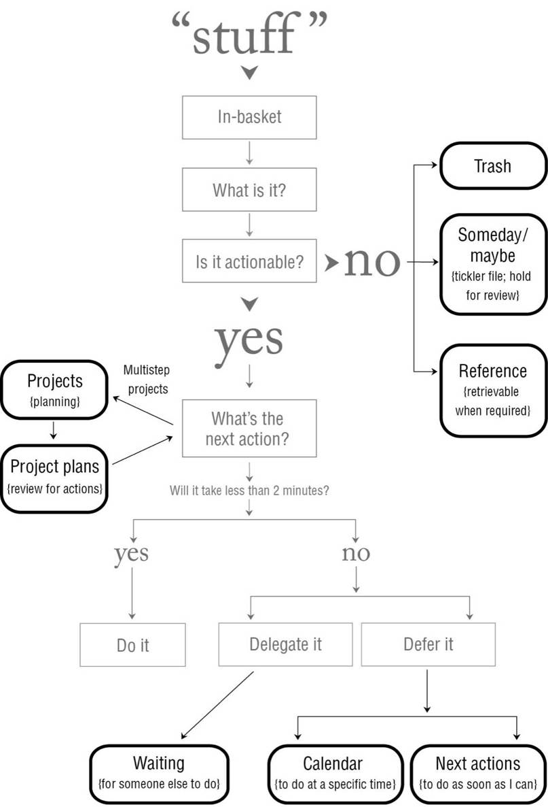

# Chapter 7: Organizing: Setting Up the Right Buckets

The Basic Categories

1. A Projects list (project persepctive)
2. Project support material (project folder)
3. Calendar actions and information (calender)
4. Next Actions lists (next actions tags, Focus perspective)
5. A Waiting For list (waiting for, defer until))
6. Reference material (abcdefg.. file)
7. A Someday/Maybe list (tag0

