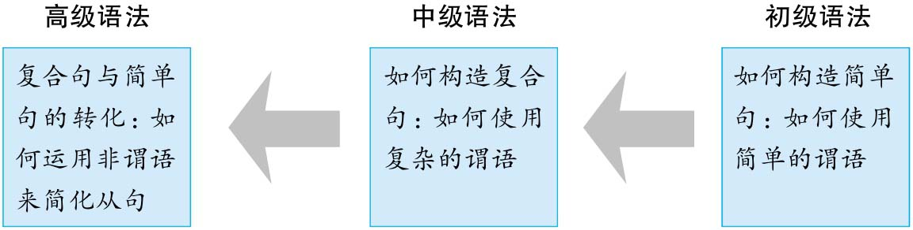

# Introduction

作者：张满胜

书籍：英语语法新思维（初级、中级和高级）

## 本书特色

### 1. 形式和意义

语法也有形式（form）、意义（meaning）和用法（usage）这三方面：

形式：比如“现在完成进行时”的构成形式是have been doing

意义：比如“现在完成进行时”可以表示“一个活动从过去一直延续到现在说话时刻”这样的含义

用法：即在什么样的语境中，采用何种语法结构来表达特定的意义才合适。知道形式和意义，但仍可能用错，比如下面的错误例句，

> I have been coming to Beijing fourteen times.

虽然正确的写出了现在完成进行时的形式，也知道它有表重复动作的意义，但却不能恰当的表达。

### 2. 句子与语境

有时候，语境决定了一个句子真正要表达的意思。

> Father: Do you drink?
> Young Man: No, thanks, I'm cool.
> Father: I'm not offering; I'm asking IF you drink. Do you think I'd offer alcohol to teenage drivers taking my daughter out?

### 3. 动作与状态

“读懂≠会用”

## 本书结构

初级：以名词短语和动词作为两大主线。

中级：以从句和谓语动词作为两大主线。

高级：以从句和非谓语动词作为两大主线。