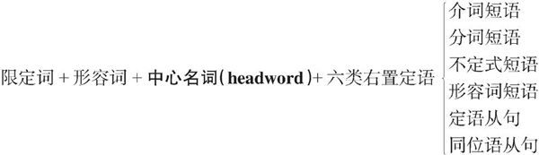

# 0.2.2　名词短语的构造——“左二右六”的定语规律

名词的修饰语可以放在被修饰名词的：

1. 前面，称之为**前置定语**，有两种修饰语

   1. **限定词**，用来限定名词所指的范围，对名词起泛指或特指、定量或不定量等的限定修饰作用。

   2. **形容词**，是用来表示名词的性质和特征的。

2. 后面，称之为**后置定语**修饰语种类则很多，具体见下图。

英语和汉语差别

- 英语定语语序遵循**左二右六**”规律，如下图

前置定语的两个定语的位置关系非常明确和严格：必须是限定词在形容词的左边，结构是：**限定词＋形容词＋名词**。

- 英语序差不多与汉语相反

英语更多的是后置定语。

