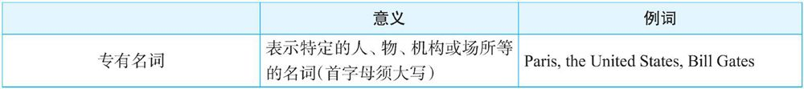
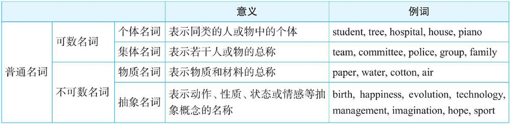

# 1.1.2　名词的分类

名词按两个标准分类：

## 按一般标准分

一般来讲，英语中的名词通常分为两大类：专有名词（proper noun）和普通名词（common noun）

### **专有名词**

#### 1．人名及头衔

比如：Winston Churchill, the Queen of England, the President of the United States, Doctor Mathews, Professor Samuels等。

#### 2．著作名称

比如：War and Peace（《战争与和平》），The Merchant of Venice（《威尼斯商人》），Pride and Prejudice（《傲慢与偏见》）

#### 3．月份

一年中12个月份的名称[^1]。

#### 4．星期、四季

一周七天和一年四季

#### 5．节日

比如：Christmas, Easter, New Year's Day, Mother's Day, Thanksgiving Day等。

#### 6．地理名称

##### 1）国家及大洲的名称

如：America, Africa, Europe, Asia, England, Scotland, China, Peru, Albania等。

##### 2）地区、城市的名称

如：Rome, Vancouver, Beijing, Florence, California, Florida等。

##### 3）江、河、湖泊的名称

如：the Atlantic, the Dead Sea, the Pacific, Lake Victoria, Lake Michigan, the Rhine, the Thames, the Nile等。

##### 4）山脉、沙漠的名称

如：the Himalayas, the Alps, the Sahara等。

### 普通名词

对于普通名词，还根据“是否可以被分割”分为可数名词（countable noun）[和不可数名词（uncountable noun）](..\section2\subsection1.md)，这是名词最重要的分类。

## 按构成分

- 简单名词：组成部分不可被分割的名词，比如story, student和teacher等。

- 复合名词：由若干单词组合而构成的名词，比如girlfriend, roommate和mother-in-law等等。

[^1]: 英文中的12个月都使用阳历（the solar calendar），表达阴历（the lunar calendar），有特殊的说法。比如：“阴历二月”，the second month on the lunar calendar，或者the second lunar month，中国传统节日都用阴历表达。