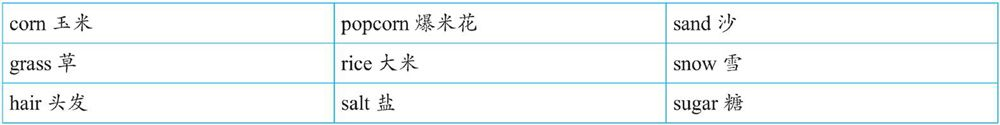

# 1.2.1　常用作不可数的名词

不可数名词有以下规律，笔者这里将其分为五组：

## 无法分割的物质名词

气体：air, fog, oxygen, smoke等。

液体：beer, blood, coffee, cream, gasoline, honey, juice, milk, oil, tea, water, wine等。

固体：bread, butter, cheese, ice, ice cream, meat, beef, chicken, fish, chalk, copper, cotton, glass, gold, iron, paper等。

## 组成部分太小而不易数的物质名词

## 总称名词

## 抽象名词

上面这些名词可以有其他不同的意思，因而可以转化为可数名词。

## 研究学科

