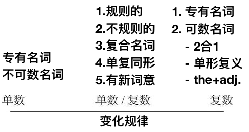

# 1.3　名词的数（二）：单数与复数

从**形式**上来总结**可数名词**的复数变化规则

|      | 不可数名词 | 可数名词 |
| ---- | ---------- | -------- |
| 单数 | 有         | 有       |
| 复数 | 无         | **有**   |

可数名词的单复数形式通常不同，因此对于可数名词来说，存在一个变复数的问题

