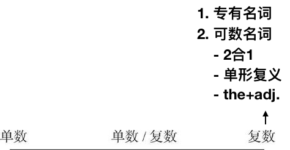

作主语时，谓语要用复数形式

## 1. “二合一”的复数名词

这些名词表示由相等的两个部分合在一起构成的工具，包括工具和仪器（glasses等），和服装（jeans）

> Where **are** my glasses? 

## 2. “单形复义”的名词

有些名词虽然没有复数的标记（比如以-s结尾），但用作复数，即形式上是单数但是表达复数的意义

> There **were** many **peoplein** the room.
>

## 3. “the＋形容词”——表示一类人的复数名词

“the＋形容词”表示一类人，此时当作复数名词，作主语时，谓语要用复数

> **The rich** **are** becoming richer

## 4. 复数专有名词

有些专有名词只用作复数，如the Alps
