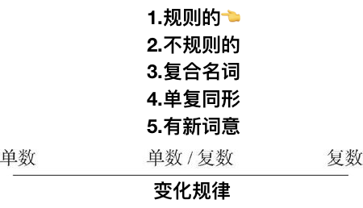

# 1.3.4　规则的复数名词

## 一般在词尾加-s

desk/desks

## 以-s, -x, -ch, -sh结尾的名词加-es

class/classes,

特别注意：以-ch结尾的名词，若-ch发/k/音，则加-s，例如：stomach/stomachs。

## 以-y结尾的名词

1.以“辅音字母＋y”结尾，变-y为-i，再加-es

country/countries

2.以“元音字母＋y”结尾，则加-s

play/plays

## 有关以-o结尾的名词

1．一般加-es的名词有：

tomato/tomatoes（西红柿）

这些一般是以“辅音字母＋-o”结尾的名词。

2．一般加-s的名词有：

以上这些一般是以“辅音字母＋-o”结尾的外来词或缩写词。

kilo/kilos（千克）

另外还有以“元音字母＋-o”结尾的名词变复数也是加-s的：

bamboo/bamboos（竹子）

3．少数名词后加-s或加-es均可：

memento/memento(e)s（纪念品）

📓

中学的时候，老师这样教，个人觉得更好记忆，

1.元音+o

- +s

2.辅音+o

- 有生命，+es
- 无生命，+s

## 有关以-f或-fe结尾的名词

1．一般变f, fe为v，再加-es的词有下面12个：

calf/calves（小牛）

half/halves（一半）

knife/knives（小刀）

leaf/leaves（树叶）

life/lives（生命）

loaf/loaves（一条，一只）

self/selves（自身）

sheaf/sheaves（一捆，一束）

shelf/shelves（架子）

thief/thieves（贼）

wife/wives（妻子）

wolf/wolves（狼）

2．一般直接加-s的名词有：

3．少数名词后加-s或变f, fe为v加-es均可：

dwarf/dwarfs/dwarves（矮人）

📓 

以-f或者-fe结尾的词分为两类

- 去f\fe，+ves的，有12个，需要强行记忆
- 剩下的，直接+s