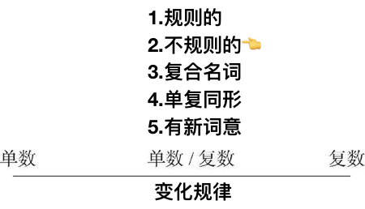

# 1.3.5　不规则的复数名词

不规则名词的复数变化形式，根据名词的特定词尾来变化。具体包括：

## 以-a结尾的拉丁语名词
词尾变为-ae或-as（少数词）。例如：alga/algae（海藻）
## 以-ex或-ix结尾的拉丁语名词
在词尾直接加-es，或把-ex和-ix变为-ices。例如：
## 以-is结尾的希腊语名词
变-is为-es。例如：thesis/theses（论文）
## 以-on或-um结尾的名词
变-on或-um为-a，有的可在词尾直接加-s。例如：bacterium/bacteria（细菌）
## 变-oo-为-ee-。
例如：foot/feet（脚）
## 变-ouse为-ice。
例如：mouse/mice（老鼠）
## 以-us结尾的拉丁语名词
变-us为-i，有的可在词尾直接加-es。例如：alumnus/alumni（男校友）