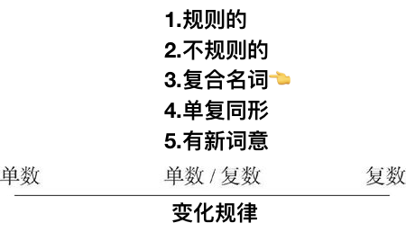

# 1.3.6　复合名词变复数

## “man/woman＋名词”构成的复合名词
由“man/woman＋名词”构成的复合名词，两个词均须变为复数。例如：man teacher/men teachers（男老师）
## 以-man/-woman/-child结尾的复合名词
以-man/-woman/-child结尾的复合名词变复数时，将-man/-woman/-child变为复数。例如：fireman/firemen（消防员）
但是German不是一个合成词，所以其复数形式是在词尾直接加-s，即Germans。
## “名词＋介词或介词短语”构成的复合名词
“名词＋介词或介词短语”构成的复合名词变复数时，将主体名词（或者说中心名词）变为复数。例如：
passer-by/passers-by（过路人）
## 由短语动词演变成的复合名词
由动词短语演变成的复合名词，一般没有主体名词，变复数时在词尾加-s。例如：forget-me-not/forget-me-nots（勿忘我）
## “名词＋形容词”构成的复合名词
“名词＋形容词”构成的复合名词变复数时，变名词为复数。例如：secretary general/secretaries general（秘书长）