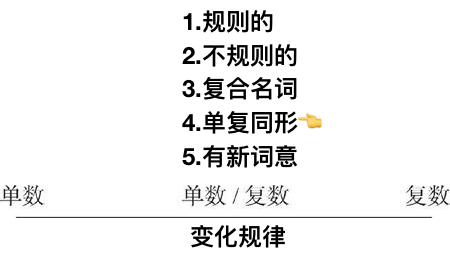
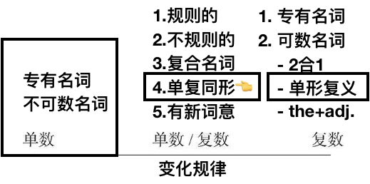

# 1.3.7　单复数同形的名词（零复数名词）

这些名词用作单数或复数，词形完全一样
## 动物名称
### 永远用作零复数
sheep（绵羊）从来没有sheeps*这个词形。
### 通常用作零复数
bison（北美野牛）a bison/two bison
### 零复数和规则复数均可
antelope（羚羊）复数可以是antelope，或者是antelopes。
对于这名词，用零复数往往是把那些动物当作整体来看，而采用规则复数则表示不同的个体及种类。请看例句：
We caught only a few fish. 我们只抓到了几条鱼。
the fishes of the Mediterranean 地中海的鱼
## 国籍名称
以-ese结尾的国籍名词常用零复数。常见的这类名词有：“13亿中国人”是1.3 billion Chinese

## 单数形式的对比

因此，没有形式变化的名词有三类：
第一类是不可数名词，如music，它们没有词形的变化，只能**用作单数**。
第二类是复数可数名词，如people，它们没有词形的变化，只**能用作复数**。
第三类是单复数同形的名词，如sheep，它们没有词形的变化，但**既可以用作单数，也可以用作复数**。

