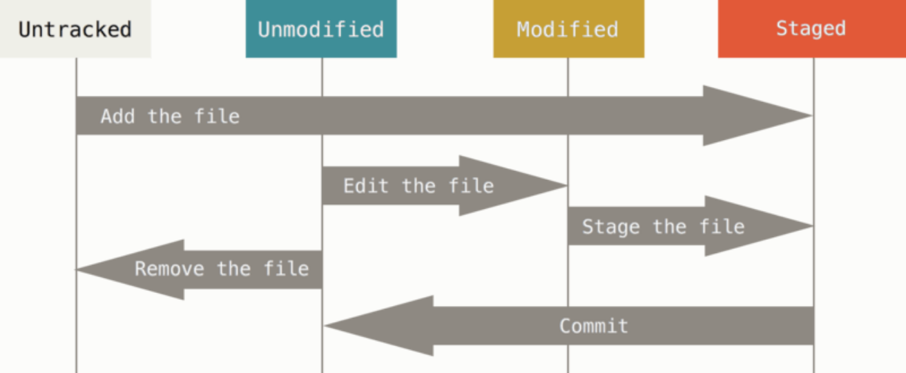

# 2.2 Recording Changes to the Repository

## 基础知识

文件的四种状态：



由于stage这个动词在原文档中使用频率高，在此写条笔记，stage表示将modified或者untracked状态下的文件通过`add`命令，或者将removed文件通过`rm`命令，或者将renamed文件通过`mv`命令加入到staging area。

## 检查Repo中文件夹的状态

如果需要完整的信息，执行以下命令

```
$ git status
```

如果需要简洁的信息，执行以下命令

```
git status -s
```

如果`git status`还无法满足需求，执行以下命令（待补充）

```
$ git diff
```

## Begin tracking files

需要手动指示git来跟踪文件，因为Repo中有些文件并不需要跟踪，比如配置文件。

```
$ git add <文件名>
```

如果文件名是个文件夹，git跟踪文件夹下所有东西。

## Stage Modified files

```
$ git add <文件名>
```

与Begin tracking files是一样的命令。如果add之后，又对文件进行修改，则需要再`add`一遍。

## `.gitignore`文件

github上有完整的[`.gitignore`文件](https://github.com/github/gitignore)。

# Commit

将Staging Area中的改变commit掉，即从staged$$\rightarrow$$committed

```
$ git commit -m 'msg'
```

或者，跳过Staging Area，不用`add`，直接把tracked files的改变commit掉，即从modified$$\rightarrow$$committed

```
$ git commit -a -m 'msg'
```

## 删除文件

### 第一种情况：保留文件夹

```
$ git rm --cached <文件名>
```

然后在`.gitignore`中把文件加进去。

### 第二种情况：不保留文件夹

删除文件夹

```
$ rm <文件名>
```

Stage改变（不是用add），最后[commit](#Commit)掉

```console
$ git rm <文件名>
```

以上两种情况中，如果文件在Staging area中，那么在`git rm`命令中要加上`-f`选项。

## 移动文件

```
$ git rm <文件名>
```

然后[commit](#Commit)掉