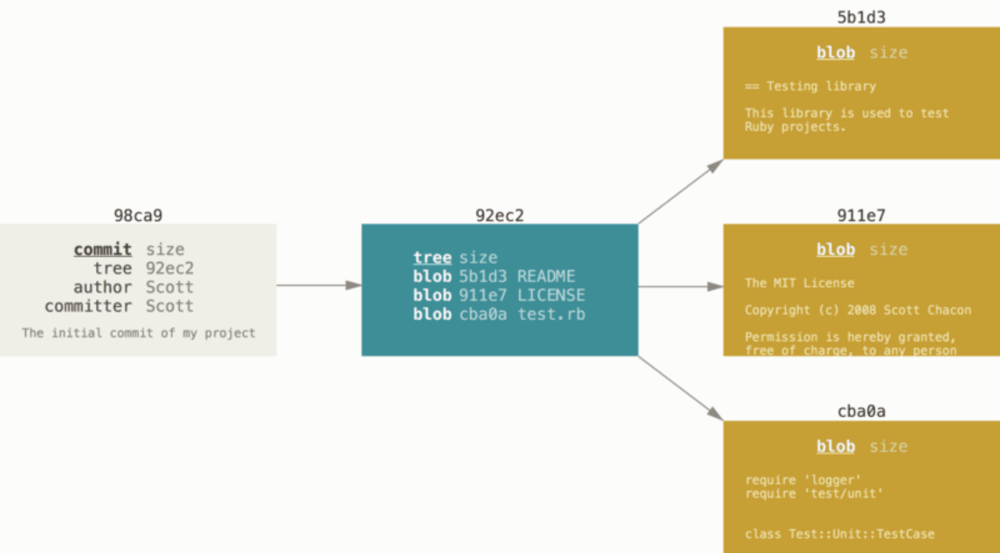
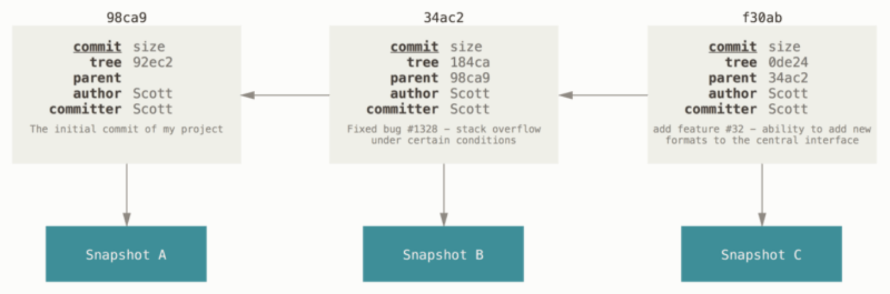
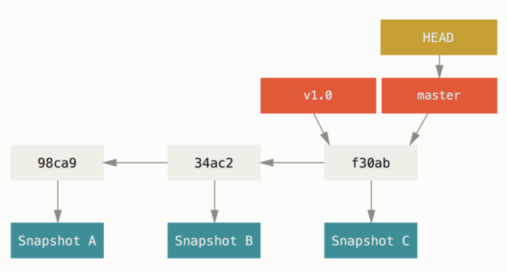
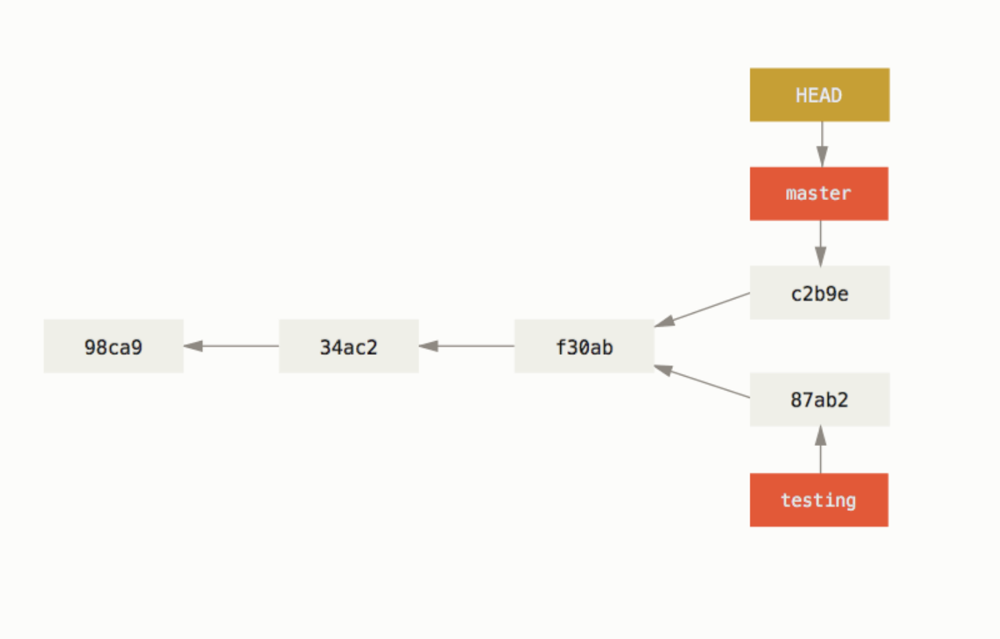
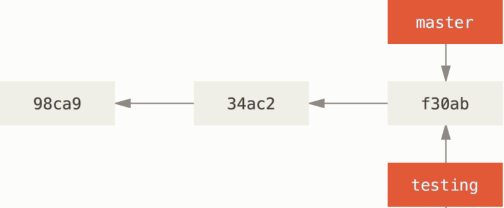
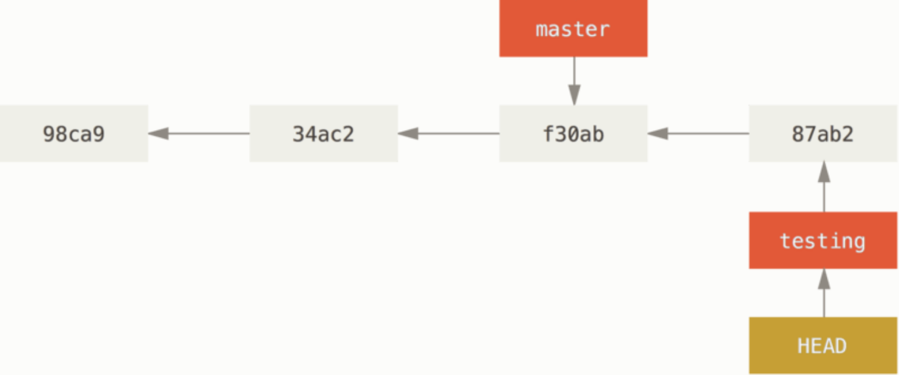

# 3.1 Branches in a Nutshell

## 基础知识

Git储存数据的方式：snapshots。当你make a commit时，会有a commit object，储存的信息如下面两张图：



A commit object除了储存author，commit msg这些常规信息，还储存了当前commit下的snapshot。一个snapshot包含一个 tree，储存文件名和blobs的映射信息，blobs指向committed files的版本信息；



除此之外，A commit object还储存了parent的信息，指向这个commit之前一个或多个commit：

- 0个？initial commit
- 1个？正常的commit
- 多个？存在merge

## Branch的概念

A branch本质上是一个指向某个commit object的pointer；HEAD指向当前所在branch



diverged branches的概念，两个有着common ancestor的branches指向了不同的commit objects




## Creating a New Branch

```
$ git branch testing
```

创建了一个名为testing的branch，指向当前commit



如果想直接switch到这个branch，使用

```
$ git checkout -b testing
```


## Switching Branches

```
$ git checkout testing
```

将HEAD指向testing，之后若再做出commit，那只是对testing这个branch的指向作出改变



如果之后，再移动到master这个branch，工作区所有的文件都会被复原到`f30ab`这个commit中储存的snapshot下

