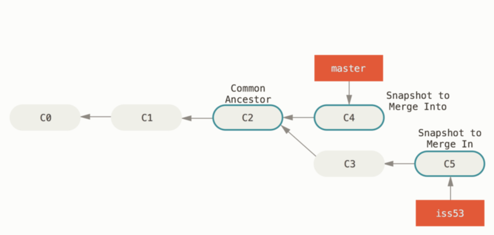
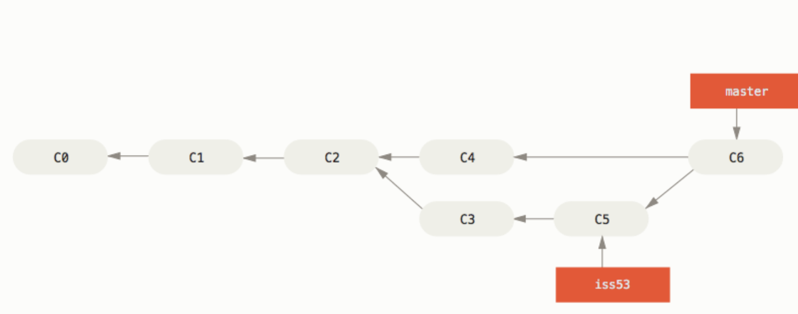

# 3.2 Basic Branching and Merging

## Basic Branching

这一节讲了branching的基础工作流，比方说你在做一个网站，Head当前在Master上。

第一件事情：需要处理一个issue，那么要新建一个branch，命名为issue。

第二件事情又出现了：需要紧急修一个bug，于是你回到Master，再新建一个branch，修好bug后commit掉。

因为这个bug影响到网页编写，于是顺手merge掉Master和bug所在的branch，最后删掉bug的branch。最后，你回到issue branch继续修理。

删掉`iss53` branch的方法：

```
$ git branch -d iss53
```


## Basic Merging

```
$ git checkout master
```

swith header后，

```
$ git merge iss53
```

情况一：当前的branch指向的commit object是被merged的branch的commit object的一个direct ancestor，Git使用fast-forward方法进行merge

情况二：不是direct ancestor，使用three-way merge





## Basic Merge Conflicts

当两个commit对同一个文件作出修改时，使用`$ git merge`不会成功，解决冲突，请follow以下步骤

```
$ git status
```

找出冲突文件

```html
<<<<<<< HEAD:index.html
<div id="footer">contact : email.support@github.com</div>
=======
<div id="footer">
 please contact us at support@github.com
</div>
>>>>>>> iss53:index.html
```

进入冲突文件后发现是这样的

```
<div id="footer">
please contact us at email.support@github.com
</div>
```

删干净，只保留下想要的，然后stage files，最后merge掉

