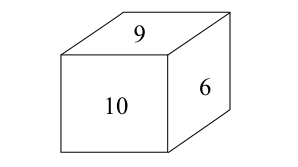

# 核心方法

基础方法为排除法，数学特性法和方程法；

提高方法为：赋值法和线段法

## 代入排除法

基本的解题思路是，根据题干，判断题型。根据题型选择解题方法。

### 适用范围

- 选项信息充分：
  - 题干中的变量=选项中的变量
  - 选项为一组数、可转化为一组数
  - 题目中含关键字：
    - 分别是
    - 各是
    - ...和...之比是

  - 复杂题目：人多、数少、关系乱或者方程复杂（排队题etc）

### 常用题型

年龄、不定方程和复杂方程比较常用

- **年龄问题**
  - A的年龄大B.……，求A、B年龄
- **不定方程问题**
  - 变量数量 > 方程数
- **复杂方程问题**
  - 首先列出方程，然后再依次代入验证条件
- 多位数问题
  - 题干的变量是三位数以上，且对该变量给出条件
- 和差倍比问题
  - $$\frac{x+n}{y}=\frac{a}{b}$$，求x或y

### 具体用法

使用排除法，或者代入法，或者两者结合解题

- 排除选项法，把选项和题干信息对比时，可以从以下角度考虑
  - 尾数：[容斥原理问题](section2.md#容斥原理问题)用的多
  - [奇偶](#奇偶特性)：[不定方程组](#不定方程组)
  - [倍数](#倍数特性)：用的最多
  - 大小：倍差关系，已知答案的位数，计算选项时，先判断位数；

- 代入法，把选项代入方程式时，代入顺序可以从以下角度考虑
  - 题干条件：优先选择简单的条件验证，比如和差关系比倍数关系好考虑
  - 最值问法：如果题目问最大，先从最大的选项开始
  - 代入方向：

> 【例 1】(2018 江西)一家三口，妈妈比儿子大 26 岁，爸爸比儿子大 33 岁。1995 年，一家三口的年龄之和为 62。那么，2018 年儿子、妈妈和爸爸的年龄分 别是:
>
> A.23，51，57 B.24，50，57
> C.25，51，57 D.26，52，58

解析：年龄问题，代入法或者方程法，先使用简单的题干条件，爸爸比儿子大33岁，排除掉ACD项，选B

> 【例 2】(2019 北京)某工厂有甲、乙、丙 3 条生产线，每小时均生产整数 件产品。其中甲生产线的效率是乙生产线的 3 倍，且每小时比丙生产线多生产 9件产品。已知 3 条生产线每小时生产的产品之和不到 100 件且为质数，则乙生产 线每小时最多可能生产多少件产品?
>
> A.14 B.12
> C.11 D.8

解析：工程问题，使用方程法，又是不定方程组，考虑代入法，题目是最值问法，最大从14开始，代入4得89，89不能被2整除，也不能被3，5，7，9整除，因此是质数，符合条件，选A

⚠️ 质数是只能被1和本身除的数，要想验证n是质数，查看n是否能被$$\sqrt{n}$$以内的数整除，如果能，则不是质数。

> 【例 3】 (2016 广东)大型体育竞赛开幕式需要列队，共 10 排。导演安排演 员总数的一半多一个在第一排，安排剩下演员人数的一半多一个在第 2 排......依 次类推。如果在第 10 排恰好将演员排完，那么参与排队列的演员共有多少名?
>
> A.2000 B.2008
> C.2012 D.2046

解析：可以使用方程法解决，但是方程过于复杂，使用代入法，设总共有x人则$$\frac{\frac{x}{2}-1}{2}$$	为整数，选D

## 数学特性法

主要有奇偶和倍数两个特性，当计算均为整数时，需要考虑

### 奇偶特性

- 适用范围
  - 不定方程问题：如果题干给出了答案的关系式，通过观察关系式子，推算出答案的奇偶特性；
  - 知和求差、知差求和：答案是求差或求和，找题目中是否有和\差，从而判断答案的奇偶特性
  - 2倍、平均、相等、偶数

- 具体用法
  - 和差
    - 同奇同偶才为偶
    - 一奇一偶则为奇
  - 乘积
    - 一个为偶则为偶
    - 全部为奇才为奇

### 倍数特性

- 适用范围
  - “（百）分数”，“倍数”，“比例”，“分担”

- 具体用法
  - 整数型：$$X=a\times b$$，则X能被a或b整除
    - 若 $$a=m\times n$$，且m和n没有公约数，则X能被a整除 
    - 若X能被a和b同时除，则能被$$a\times b$$同时除
  - 余数型：若$$y=ax+b$$，则$$(y-b)$$能够被$$a$$整除
  

> 【例 1】 (2017 福建)如图，一个正方体的表面上分别写着连续的 6 个整数， 且每两个相对面上的两个数的和都相等，则这 6 个整数的和为:
>
>  
>
> A.53 B.52
> C.51 D.50

解析：未知数数量=方程数量，为常规方程组，但解起来比较麻烦，选项也无法使用代入法，发现结果和3有倍数关系，只有C可以被整除，选C

> 【例 2】(2017 江西)某公司研发出了一款新产品，当每件新产品的售价为3000 元时，恰好能售出 15 万件。若新产品的售价每增加 200 元时，就要少售出1 万件。如果该公司仅售出 12 万件新产品，那么该公司新产品的销售总额为:
>
> A.4.72 亿元 B.4.46 亿元
> C.4.64 亿元 D.4.32 亿元

解析：常规方程组，同时发现答案和12有倍数关系，12=3*4，能被3整除的只有D，选D

> 【例 1】(2016 深圳)两箱同样多的蛋黄派分别分发给两队志愿者做早餐， 分给甲队每人 6 块缺 8 块，分给乙队每人 7 块剩 6 块，已知甲队比乙队多 6 人， 则一箱蛋黄派有多少块?
>
> A.120 B.160
> C.180 D.240

解析：常规方程组，同时发现答案+8与6有倍数关系，6=3*2，+8后能被3整除的只有B。

> 【例 2】(2015 江苏 A)一群大学生进行分组活动，要求每组人数相同，若 每组 22 人，则多出一人未被分进组;若少分一组，则恰好每组人数一样多。已 知每组人数最多只能 32 人，则该群学生总人数是:
>
> A.441 C.536
>
> B.529 D.528

解析：常规方程组。同时发现答案-1与22=2*11有倍数关系，只有A和B符合选项，考虑代入法，发现441不能被19整除，因此选B

> 【例 3】(2018 陕西)苗苗有一堆草莓，乐乐也有一堆草莓。苗苗的草莓五 个五个地数，最后剩两个，七个七个地数，最后还是剩两个;乐乐的草莓五个五 个地数，最后剩四个，六个六个地数，最后剩三个。已知苗苗比乐乐多 8 个草莓， 则苗苗的草莓数为:
>
> A.37 B.62
> C.72 D.77
> E.87 F.92
> G.102 H.107

解析：方程法，应该是常规的。考虑倍数特性，被5和7除，都余下2，说明能被35除，将剩下的选项代入，选H

- 判定法则
  - 口诀
    - 3/9只看各位数字之和：某个数能被3/9整除，则其各位数字的和能被3/9整除
    - 2/4/8；5/25/125只看末两/三位数
  - 因式分解
    - 判断能否被$$A\times B$$整除，只需判断是否能同时被$$A$$和$$B$$整除
    - $$A$$和$$B$$必须互质

## 方程法（重要）

方程分为两类，一是常规方程组，二是不定方程组。常规方程组又分为一元和二元。根据变量是否为整数，不定方程组又分为限定的和不限定的。

### 常规方程组

- 适用范围
  - 存在明显等量关系
    - 提到”共有……“，”多/少……“等字眼
    - 经典问题中的公式，如等

- 常用题型
  - 和差倍比
  - 浓度
  - 牛吃草
  - 利润
  - 行程
  - 工程
- 具体用法
  1. 设未知数
     1. 设最小数
     2. 设中间数（比如已知$$\frac{x}{y}=\frac{a}{b}$$、$$\frac{z}{y}=\frac{c}{d}$$则设份数为未知数m，得出连比关系：$$x:z:y=(ad)m:(cb)m:(bd)m$$
  2. 把其他未知量用未知数表示
  3. 利用等量关系，列方程（组）求解

### 不定方程组

*适用范围*

- 未知数个数多于方程个数

*常用题型*

- 和差倍比
- 利润

*具体用法*

- 限定性不定方程
  - [奇偶](#奇偶特性)
  - [倍数](#倍数特性)
  - 尾数
    - 5的倍数，尾数只能为0（偶数），5（偶数）
- 非限定性不定方程
  - 多项式的整体代换
  - 赋零法：尽量取两式都有的量为0

## 赋值法

### 适用范围

- 题干中没有出现具体的值
- 在$$A=B\times C$$这样的三量关系中，至多给出其中一个量的具体值

### 常用题型

- [工程问题](section2.md)

- 行程问题

- 经济利润问题

- 浓度问题

### 具体用法

1. 对题目中的不变量赋值（即所有公式都会出现的变量）
2. 根据所给数字赋值公倍数（总量赋值一般用公倍数）
   - 比如已知$$a\times b = c$$，题目中给出了符合这个条件的两个公式，那么要根据a\b对应的两个值，取公倍数
   - 如果一个量都没给出，可以赋值两次
3. 根据所给比例关系赋值（见[常规方程组](#常规方程组)中设中间数为未知数）
4. 赋值尽量便于计算和简化

## 线段法

### 适用范围

*混合比例问题*

- 混合：两个或多个部分组成一个整体
- 比例：计算公式位两个量相除的形式

### 常用题型

- 浓度混合
- 平均数混合
- 利润率混合
- 折扣混合
- 比例混合
- 增长率混合

### 具体用法

1. 混合之前写两端，混合之后写中间
2. 距离和量成反比，份数计算不能反

### 注意事项

- 混合浓度，对应溶液量之比
- 混合平均数，对应人数之比
- 混合利润率，对应成本之比
- 混合折扣，对应定价之比
- 混合比重，对应总体之比
- 混合增长率，对应基期量之比