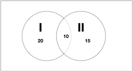

# 高频考点

Tracking

81m33.286s

79m15.730s

40m22.391s

19m48.574s 

## 工程问题

对总量型和效率型可以使用赋值法，对于具体值型可以使用方程法结合奇偶特性求解。

### 赋值总量型

*识别*

给出多个完成工程的时间

*方法*

赋值总量$$\rightarrow$$算出效率$$\rightarrow$$列式求解

*技巧*

总量一般设公倍数，公倍数难算用乘积

### 赋值效率型

*识别*

题干给出了效率比、效率倍数等

*方法*

赋值效率$$\rightarrow$$算出总量$$\rightarrow$$列式求解

*技巧*

按照比例设效率，设值尽量设整数

### 给具体值型

*识别*

题干有效率、时间、总量三个量中的至少两个量的具体指

*方法*

代公式$$\rightarrow$$列方程求解

## 行程问题

### 普通行程

基础行程

路径=时间$$\times $$速度

等距离平均速度

- 题型：当题干中两个速度走过的举例相同时；常见往返与上下坡
- 公式：$$\frac{2v_1v_2}{v_1+v_2}$$

### 相对行程

*相遇、追及*

- 相遇问题
  - 路径和=(大速度+小速度)$$\times $$时间
  - 线性多次相遇
    - 两头分别出发：$$(2n-1)s=$$路径和
    - 一头同时出大：$$2n\times s=$$路径和
- 追及问题
  - 路径差=(大速度-小速度)$$\times $$时间

*顺水、逆水*

- 顺水行舟：路径=(船速+水速) $$\times $$时间
- 逆水行船：路径=(船速-水速)$$\times $$时间

### 比例行程

*基础知识*

- 路程一定，速度和时间成反比
- 时间一定，路程和速度成正比
- 速度一定，路程和时间成正比

*解题思路*

1. 当某个量位定制时，可考虑使用比例
2. 将比例转化为份数，或通过比例列方程

## 经济利润问题

### 常规经济利润

*基础知识*

- 利润=售价-进价​
- 利润率=利润$$\div $$进价
- 售价 = 进价$$\times$$ (1+利润率)
- 折旧=售价$$\div $$定价

*解题思路*

当题干中出现与费用、利润、利润率相关的数据时，根据上述公式列方程计算即可

### 分段计算

*题型识别*

当提供中表述“超出部分按某个标准计算”时，即为分段计算

*解题思路*

题干所给标准以内时一个单价，超出标准是另一个单价，分段计算标准内和超标准，最后根据题干中的关系计算机即可

### 统筹经济

*题型识别*

当题干中给出不同费用方案，问题中出现”最多“，”最少“ 或类似表述时

*解题思路*

综合考虑对比各种情况，选择最优方案

## 溶液问题

### 混合溶液

*基础知识*

溶质质量=溶液质量$$\times $$浓度

*题型特征*

题干给出溶液或溶质的实际量，经过混合，溶液量和溶质量都会发生变化

*解题思路*

混合溶液：公式法、方程法、线段法

### 溶质不变

*基础知识*

浓度的计算公式

*题型特征*

题干中出现溶液和谁混合或者蒸发溶液中的水

*解题思路*

以溶质量不变，溶液量变化为突破口，采用赋值法、公式法

### 溶液不变

*基础知识*

- 浓度的计算公式
- 溶质质量=溶液质量$$\times $$浓度

*题型特征*

溶液之间进行多次混合，其中一溶液的溶液量或两溶液的溶液量之和不会变

*解题思路*

以溶质量变化，溶液量不变为突破口，采用赋值法、公式法

## 排列组合与概率问题

排列组合问题重点掌握基础概念和插孔法。

### 基础概念

- 分类和分步
  - 分类用加法（要么……要么……）
    - 比如，某人去上海，**要么**搭飞机，**要么**乘火车，那么去上海一共有1+1=2种选择
  - 分步用乘法（先……再……）
    - 比如，某人去上海，先搭飞机，有3架飞机可以选，再乘火车，有2部火车可以选，一共有$$3\times 2=6$$种选择
- 有序和无序
  - 有序用排列（不可互换，计算用A）
    - 比如，共有5个标号的球，随机抽3个，共有$$A^3_5$$种可能
    - $$A^n_m$$表示从m往下乘n个数
  - 无序用组合（可以互换，计算用C）
    - 比如，从3个白球和2个黑球中，随机抽3个，共有$$C^3_5$$种可能
    - $$C^n_m=\frac{A^n_m}{A^n_n}$$，结果一定是整数
- 例题

> 【例 1】(2017 山东)某部门从 8 名员工中选派 4 人参加培训，其中 2 人参 加计算机培训，1 人参加英语培训，1 人参加财务培训，问不同的选法有多少种?
>
> A.256 B.840 C.1680 D.5040

解析：**分步**。安排人员去做事的，一般是**先**安排做某事，**再**安排做另一件事；**无序**。安排AB两人参加计算机培训和安排BA是一样的。因此，$$C^2_8\times C^1_6 \times C^1_5=28\times 6\times 5=840$$，选B

> 【例 2】(2018 吉林)一位女士为了寻找曾经帮助她的司机，向新闻媒体提 供了她记得的车牌信息。女士看到的车牌号为“吉 AC****”，最后一位是字母， 其他三位全是奇数，且数字逐渐变大，那么符合要求的车牌有:
>
> A.380 个 B.260 个C.180 个 D.460 个

解析：**分步。**车牌数是一位一位算下来的。不必考虑有序或无序，因为都只选出一位数。基础知识，0-9一共十位数，奇数有5个；字母一共有26位。奇数逐渐变大，将数字位看成一个整体，内部有顺序，先取数，共有$$C^3_5=10$$种取法，每一种取法只有一种顺序。因此$$10\times 26=260$$，选B

> 【例 3】(2018 联考)甲、乙、丙三所学校的学生被安排在周一至周五参观 某革命纪念馆。纪念馆每天最多只能安排一所学校，其中甲学校连续参观两天， 其余学校均只参观一天，那么共有多少种安排方法?
>
> A.12 B.24 C.36 D.60

解析：分步。有序。先单独考虑甲，五天中两天连续，枚举发现有四种情况。剩下三天选两天，内部有序，使用$$A^2_3=6$$，$$6\times 4=24$$，选B

> 例 4(2017 四川)某交警大队的 16 名民警中，男性为 10 人，现要选 4 人进 行夜间巡逻工作，要求男性民警不得少于 2 名，问有多少种选人方法?( )
>
> A.1605 B.1520 C.1071 D.930

解析：先分类，至少要2名分2、3、4三种情况，后分步，先选出男民警，再选出女民警。无序，因为选出来做的事情一样，都是巡逻。2名时，$$C^2_{10}\times C^2_6=45\times 15$$，尾数为5；3名时，$$C^3_{10}\times C^1_6=120\times 6$$，尾数为0；1名时，$$C^4_{10} =10\times 3\times 7$$，尾数是0，答案尾数为5，选A

> 【例 5】(2017 吉林)罐中有 12 颗围棋子，其中 8 颗白子，4 颗黑子。从中 任取 3 颗棋子。则至少有一颗黑子的情况有:
>
> A.98 种 B.164 种 C.132 种 D.102 种

解析：先分类，再排序。至少有一颗黑子，可以反着想，即没有黑子的情况有$$C^3_8=\frac{8\times 7\times 6}{3\times 2\times 1}=56$$，总共的排列方法是$$C^3_{12}=\frac{12\times 11\times 10}{3\times 2\times 1}=220$$, 后者减去前者，尾数为4，选B

### 常用方法

- 捆绑法：先捆绑后再排序

> 【引例】甲乙丙丁戊己 6 个老师站成一排照相，要求甲乙丙 3 人必须相邻， 有( )种不同的站法?

解析：看成（甲乙丙）、丁戍己四位老师，无需分类分布，直接有序排序，共有$$A^4_4=24$$种排法，（甲乙丙）内部有序排序有$$A^3_3=6$$种排法，则一共有144种排法

> 【例 1】 (2017 重庆选调)某画廊设计展出 10 幅不同的画，其中 5 幅国画，4 幅油画，1 幅水彩画，展览时排成一行，要求同一品种的画必须靠在一起，且水彩画不放在两端，那么不同的陈列方式有多少种?

解析：水彩只能放在中间，则一共有$$A^2_2\times A^5_5\times A^4_4$$种排法

> 【例 2】 (2017 广东)单位工会组织拔河比赛，每支参赛队都由 3 名男职工 和 3 名女职工组成。假设比赛时要求 3 名男职工的站位不能全部连在一起，则每 支队伍有几种不同的站位方式?
>
> A.432 B.504
> C.576 D.720

解析：分步有序排序，反向求解$$A^6_6-A^4_4\times A^3_3=720-24\times 6$$尾数为6，选C

- 插空法：先排列再插空

> 【引例】甲乙丙丁戊己，6 个老师站成一排照相，要求甲乙丙 3 人必须不相 邻，有( )种不同的站法?

解析：分步有序排序，先拍丁戍己，再拍甲乙丙，丁戍己，一共有$$A^3_3\times A^3_4=6\times 24=144$$

> 【例 3】(2017 江苏)两公司为召开联欢晚会，分别编排了 3 个和 2 个节目， 要求同一公司的节目不能连续出场，则安排节目出场顺序的方案共有:
>
> A.12 种 B.18 种
> C.24 种 D.30 种

分析：分步有序排序$$A^2_2\times A^3_3=2\times 6=12$$，选A

> 【例 4】(2018 四川下)某场学术论坛有 6 家企业作报告，其中 A 企业和 B企业要求在相邻的时间内作报告，C 企业作报告的时间必须在 D 企业之后、在 E企业之前，F 企业要求不能第一个，也不能最后一个作报告。如满足所有企业的 要求，则报告的先后次序共有多少种不同的安排方式?
>
> A.12 B.24 C.72 D.144

分步：插空分步有序，AB捆绑，DCE顺序固定，形成4个空，无论AB怎么插孔，都会和DCE内部形成3个空，由C插空。因此有$$A^2_2\times A^1_4\times A^1_3=2\times 4\times 3=24$$

- 插板法：先转化成把n个相同的物品分成m个主题（每个至少1份），再用公式
- 全错位排列：记住0、1、2、9、44​

### 概率相关

- 给出情况求概率：P=满足条件个数$$\div$$总个数

> 【例 1】(2018 浙江)某基层机关有甲和乙两个办公室，共有 10 名员工，其 中甲办公室人数为乙办公室人数的 1.5 倍。现从这 10 名员工中随机抽出 2 人借 调到上级机关，问借调的人来自同一办公室的概率为:
>
> A.1/3 B.2/5 C.4/9 D.7/15

解析：甲办公室6人，乙办公室2人，两人全部来自同一办公室的组合为$$C^2_6+C^2_4$$，全部的组合为$$C^2_{10}$$，相除得D

> 【例 2】(2018 吉林)一位乒乓球学员手中拿着装有 7 只乒乓球的不透明口 袋，其中 3 只黄球，4 只白球。他随机取出一只乒乓球，观察颜色后放回袋中， 同时放入 2 只与取出的球同色的球。这样连续取 2 次，则他取出的两只球中第 1次取出的是白球，第 2 次取出的是黄球的概率是:
>
> A.8/77 B.4/21
> C.2/11 D.4/7

解析：分步无序；第一次取出白球的概率是$$\frac{4}{7}$$，取出后球总数变为9，第二次取出黄球的概率是$$\frac{3}{9}=\frac{1}{3}$$，两者相乘为$$\frac{4}{21}$$，选B

> 【例 3】(2018 辽宁)一张纸上画了 5 排共 30 个格子，每排格子数相同。小 王将 1 个红色和 1 个绿色棋子随机放入任意一个格子(2 个棋子不在同一格子)， 则 2 个棋子在同一排的概率:
>
> A.不高于 15% B.高于 15%但低于 20%
> C.正好为 20% D.高于 20%

解析：分步无序，所有的组合情况为$$A^2_{30}$$，即50个格子选两个，同一排的概率是$$C^1_{5}\times A^2_6$$，选B

- 给出概率求概率：分类用加法，分步用乘法

> 【例 4】(2016 江苏)一辆公交车从甲地开往乙地需经过三个红绿灯路口， 在这三个路口遇到红灯的概率分别是 0.4、0.5、0.6，则该车从甲地开往乙地遇 到红灯的概率是:
>
> A.0.12 B.0.50
> C.0.88 D.0.89

解析：分步，反向思维，$$1-(0.6\times 0.5\times 0.4)=0.88$$，选C

> 【例 5】(2017 四川)某杂志为每篇投稿文章安排两位审稿人，若都不同意 录用则弃用;若都同意则录用;若两人意见不同，则安排第三位审稿人，并根据 其意见录用或弃用。如每位审稿人录用某篇文章的概率都是 60%，则该文章最终 被录用的概率是:
>
> A.36% B.50.4%
> C.60% D.64.8%

解析：分类。11+101+011，$$0.6\times 0.6 + (0.6\times 0.4\times 0.6)\times 2$$，尾数为8，选D

- 正面太难就用反面想：概率=1-反面情况概率

## 容斥原理问题

### 题型识别

条件或集合之间存在交叉重叠

### 解题方法

*公式法*

- 两集合公式：$$A+B-A\cap B=$$总数-A、B均不满足个数

> 【引例】一所学校有语文考试和数学考试，语文考试有 25 人及格，数学考试有 23 人及格，语文和数学都及格的有20 人，语文和数学都不及格的有 5 人，问全班有多少人

解析：套公式，25+23-20+5=33

> 【例 1】 (2017 广东)某单位有 107 名职工为灾区捐献了物资，其中 78 人捐 献衣物，77 人捐献食品。该单位既捐献衣物，又捐献食品的职工有多少人?

解析：套公式，78+77-107=48

> 例 2(2018 联考)某试验室通过测评I和II来核定产品的等级:两项测评都 不合格的为次品，仅一项测评合格的为中品，两项测评都合格的为优品。某批产 品只有测评I合格的产品数是优品数的 2 倍，测评I合格和测评II合格的产品数 之比为 6:5。若该批产品次品率为 10%，则该批产品的优品率为( )。
>
> A.10% B.15%
> C.20% D.25%

解析：画图，并根据比例关系赋值，如下图，合格率为90%，得出总产数为$$\frac{45}{0.9}=50$$，选C

> 【例 3】 (2016 四川)某学校 2015 年有 64%的教师发表了核心期刊论文;有40%的教师承担了科研项目，这些教师中有 90%公开发表了论文，这些论文均发 表在核心期刊上。则发表了核心期刊论文但没有承担科研项目的教师是承担了科 研项目但没有发表论文的多少倍?
>
> A.4 B.7
> C.9 D.10

解析：设总人数为100，则两项都参加的人数为 $$ 40\times 90=36$$,则只发表核心期刊的人有64-36=28人，只参加科研项目的有40-36=4人，为7倍，选B 

> 【例 8】(2018 辽宁)某班在筹备联欢会时发现很多同学都会唱歌和乐器演 奏，但有部分同学这 2 种才艺都不会。具体有 4 种情况:只会唱歌，只会乐器演 奏，唱歌和乐器演奏都会，唱歌和乐器演奏都不会。现知会唱歌的有 22 人，会 乐器演奏的有 15 人，两种都会的人数是两种都不会的 5 倍。这个班至多有多少 人?
>
> A.27 B.30 C.33 D.36

解析：直接代入二集合公式，$$22+15-5x=y-x$$；$$x>0$$；当y最大时，x=1，选C

- 三集合标准型公式：$$A+B+C-A\cap B-A\cap C-B\cap C+A\cap B\cap C=$$总数-A、B、C均不满足的个数

> 例 4(2018 陕西)有关部门对 120 种抽样食品进行化验分析，结果显示，抗 氧化剂达标的有 68 种，防腐剂达标的有 77 种，漂白剂达标的有 59 种，抗氧化 剂和防腐剂都达标的有 54 种，防腐剂和漂白剂都达标的有 43 种，抗氧化剂和漂 白剂都达标的有 35 种，三种食品添加剂都达标的有 30 种，那么三种食品添加剂 都不达标的有( )种。
>
> A.14 B.15
> C.16 D.17
> E.18 F.19
> G.20 H.21

解析：直接套三集合标准公式，观察选项，尾数都不一样，用尾数法

- 三集合非标准型公式：$$A+B+C-b-2c=$$总数-A、B、C均不满足个数：$$A+B+C=a+2b+3c$$

> 【例 5】(2017 重庆选调)一项农村家庭的调查显示，电冰箱拥有率为 49%， 电视机拥有率为 85%，洗衣机拥有率为 44%，至少有两种电器的占 63%，三种电 器齐全的占 25%，则一种电器都没有的比例为:
>
> A.10% B.15%
> C.20% D.25%

解析：直接代入三集合非标准公式$$49+85+44-(63-25)-26\times2=100-x\rightarrow x=10$$，选A

> 【例 6】 (2018 江西)某高校做有关碎片化学习的问卷调查，问卷回收率为 90%， 在调查对象中有 180 人会利用网络课程进行学习，200 人利用书本进行学习，100人利用移动设备进行碎片化学习，同时使用三种方式学习的有 50 人，同时使用 两种方式学习的有 20 人，不存在三种方式学习都不用的人。那么，这次共发放 了多少份问卷?( )
>
> A.370 B.380
> C.390 D.400

解析：直接代入三集合非标准公式，$$\frac{180+200+100-50\times 2-20}{0.9}=400$$

> 【例 7】 (2016 江苏)某单位举办设有 A、B、C 三个项目的趣味运动会，每 位员工三个项目都可以报名参加。经统计，共有 72 名员工报名，其中参加 A、B、C 三个项目的人数分别为 26、32、38，三个项目都参加的有 4 人，则仅参加一个 项目的员工人数是:
>
> A.48 B.40
> C.52 D.44

解析：直接代入三集合非标准公式，$$26+32+38-4\times2-x=72\rightarrow x=8$$，得出同时只参加两个项目的有16人，利用尾数法得C

> 练习二.(2016 国考)某出版社新招了 10 名英文、法文和日文方向的外文 编辑，其中既会英文又会日文的小李是唯一掌握一种以上外语的人。在这 10 人 中，会法文的比会英文的多 4 人，是会日文人数的两倍。问只会英文的有几人?
>
> A.2 B.0
> C.3 D.1

解析：直接代入三集合非标准公式，会英文的2x人，会法文的2x+4人，会日文的x+2人，$$5x+5=10$$，去掉小李，选D

图示法*

文氏图

*方程法*

分析人数或人次之间的关系，列方程

## 最值问题

### 最不利构造类

- 判定：至少……保证……
- 方法：最不利情况+1

### 构造数列类

- 判定：最少/少的……至多/少……；排名第N的至多/少……
- 方法：排序定位、反向构造数列、加和求解
- 提示：
  - 主体个数是否可以并列
  - 非整数：问至多向下取整，问至少向上取整

### 多级和反向构造

- 判定：都满足的至少……
- 方法：反向、求和、作差

### 复杂最值问题

- 判定：至多/少……
- 方法：考虑最极端情况，正向解题若复杂，可考虑逆向思维

## 几何问题

### 平面几何

*基础知识*

n变形的内角与外角和内角和$$=(n-2)\times 180^\circ$$

*常见公式*

- 正方形的周长$$=4a$$
- 长方形的周长$$=2(a+b)$$
- 圆形的周长$$=2\pi r$$
- 正方形的面积$$=a^2$$
- 长方形的面积$$=ab$$
- 圆形的面积$$=\pi r^2$$
- 三角形的面积$$=\frac{1}{2}ah$$
- 平行四边形的面积$$=ah$$
- 平行四边形的面积$$=ah$$
- 梯形的面积$$=\frac{1}{2}(a+b)$$
- 扇形的面积$$=\frac{n}{360}\pi r^2$$

*解题思路*

- 规则图形：按照公式列式计算或直接计算
- 不规则图形：通过割、补、平移等方法将不规则图形转化为规则图形，再按照相对应的公式列方程或直接计算

### 立体几何

*表面积公式*

- 正方体的表面积=$$6a^2$$
- 长方体的表面积=$$6(ab+bc+ac)$$
- 球的表面积=$$4\pi R^2=\pi D^2$$
- 圆柱的表面积=$$2\pi rh+ 2\pi r^2$$
- 圆柱的侧面积=$$2\pi rh$$

*体积公式*

- 正方体的体积=$$a^3$$
- 长方体的体积=$$abc$$
- 球的体积=$$\frac{4}{3}\pi R^3=\frac{1}{6}\pi D^3$$
- 圆柱的体积=$$\pi r^2h$$
- 圆锥的体积=$$\frac{1}{3}\pi r^2h$$

*解题思路*

- 立体几何多数考查基本公式的应用，直接套入公式即可

### 几何特性

*等比例缩放特性*

若将一个图形尺度放大为原来的n倍，则：

- 对应角度不变；
- 对应周长变为原来的n倍；
- 面积变为原来的$$n^2$$倍
- 体积变为原来的$$n^3$$倍

*几何最值理论*

- 平面几何中，若周长一定，越接近圆，面积越大
- 平面几何中，若面积一定，越接近圆，周长越小
- 立体几何中，若表面积一定，越接近于球，体积越大
- 立体几何中，若体积一定，越接近于球，表面积越小

*三角形三边关系*

- 三角形两边之和大于第三边，两边之差小于第三边

### 几何计数

*解题思路*

考察几何相关知识，偶尔会用到归纳法