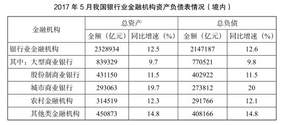
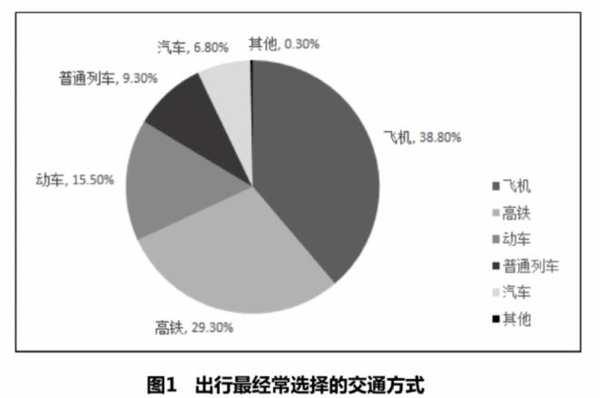

# 理论基础

## 统计术语

### 基期量
- 识别:求前面某个时期的量
  - 根据时间区分，2017年是基期，2018年是现期
  - 根据对象区分，A比B厉害，B是基期
- 公式
  - 基期量=现期量-增长量
  - 基期量=现期量/(1+r[^8])
- 速算
  - |r|>5%，截位直除
  - |r|≤5%，化除为乘[^9]
- 基期和差:先用现期和正负排除再计算
### 现期量
- 识别:求后面某个时期的量
- 公式:现期量=基期量+增长量;现期量=基期量*(1+r)
- 速算:截位计算，特殊数

### 其他

- 同比，比如2017年10月的同比基期，是2016年10月
- 环比，比如2017年10月的环比基期，是2017年9月

### 做题Tips

- 读问题，确定时间

- 判题型
  - 出现“占”就是比重问题
  - 出现“平均”就是平均数问题
  - 出现“倍”就是倍数问题

- 列式子，先别算;
  - 如果给出现期和增长量，求基期，就用现期-增长量，用减法。
  - 如果给出现期和增长率，求基期，就用现期/(1+增 长率)，用除法。

- 要想快，看选项。最快的速算取决于看选项。

> 【例 1】(2018 联考)2016 年末全国共有艺术表演团体 12301 个，比上年末 增加 1514 个，从业人员 33.27 万人，增加 3.08 万人。其中各级文化部门所属的 艺术表演团体 2031 个，占 16.5%;从业人员 11.52 万人，占 34.6%。
>
> 2015 年末，全国拥有艺术表演团体的数量是( )。
> A.10787 个 B.12301 个
> C.14237 个 D.22031 个

解析：确定是2015年，“占”字出现很多，是比重问题，出现现期和增长量，12301-1514，看选项，选A

>  
>
> 【例 2】(2018 天津)2016 年 5 月，银行业金融机构总资产金额为多少万亿 元?
>
> A.167 B.207
> C.247 D.287

解析：确定是2016年5月，算基期量，给出增速，用2328934/1.125，一步除法截分母，选项差距大，截两位，选个最接近的，选B

> 【例 3】(2017 联考)2016 年 6 月份，我国社会消费品零售总额 26857 亿元， 同比增长 10.6%，环比增长 0.92%。2016 年 5 月份，全国社会消费品零售总额约为( )。
>
> A.24594 亿元 B.24283 亿元C.26612亿元 D.27104亿元

解析：时间为2016年5月，给出环比增长0.92%，26857/1.0092，选项差距小，谨慎计算，增长率≤5%，化除为乘，26857*(1-0.92%)，选C

> 【例4】 (2018云南) 2016年，全国降水量范围为3.5毫米(新疆托克逊)~3494.4毫米(安徽黄山)，全国平均降水量730.0毫米，较常年(629.9毫米) 偏多16%，比2015年偏多13%，为1951年以来最多。2月和8月降水偏少，3月接 近常年同期，其余各月均偏多，其中1月偏多94%，10月偏多55%，均为历史同 期最多2015年全国平均降水量为:
> A.730.0毫米 B.646.0毫米
> C.629.9毫米 D.612.6毫米

解析：求2016年降水量，为730/1.13，保留三位计算，选B

> 【例5】 (2018广东)规模以上工业企业研发投入大幅提高，2016年该市规模以上工业企业R&D经费内部支出19.14亿元，比2012年增加11.52亿元，增 长151.2%，年均增长25.9%。全年技术改造经费支出10.74亿元，比2012年增 长184.9%;引进境外技术经费支出1.61亿元，增长257.8%;引进境外技术的 消化吸收经费支出0.54亿元，增长100%。2012年，该市的下列各项经费支出最多的是:
>
> A.规模以上工业企业R&D经费 
>
> B.全年技术改造经费
>
> C.引进境外技术经费 
>
> D.引进境外技术的消化吸收经费

解析：求2012年经费支出，选A

> 【例6】 (2014北京)据统计，2012年1-10月我国农产品进出口总额1414. 48亿美元，较上年同期增长16.27%。其中，出口500.52亿美元，增长4.49%， 进口913.96亿美元，增长23.92%。2011年1-10月我国农产品约实现:
> A.贸易逆差413亿美元
>
>  B.贸易逆差259亿美元
>
> C.贸易顺差413亿美元 
>
> D.贸易顺差259亿美元

解析：求2011年1-10月为，500.52*(1-4.49%)-913.96/1.2392，比大小，以坑治坑，A是现期坑，排除掉，选B

> 【例7】(2017国考)某市2015年全年粮食总产量4.16万吨，同比下降2. 3%;甘蔗产量0.57万吨，下降23.6%;油料产量0.12万吨，增长32.4%;蔬菜 产量15.79万吨，下降3.4%;水果产量7.84万吨，增长7.4%。
>
> 2014年该市蔬菜产量比水果产量约高多少万吨?
> A.9 B.8
> C.7 D.6

解析：2014年，15.79-（1-3.4%）+7.84/（1+7.4%），比现期大，选A

> 【例1】(2017浙江)按经营单位所在地分，2016年6月份，城镇消费品零 售额23082亿元，同比增长10.5%;乡村消费品零售额3775亿元，同比增长11. 2%。1~6月份，城镇消费品零售额134249亿元，同比增长10.2%;乡村消费品 零售额21889亿元，同比增长11.0%。
>
> 按2016年1~6月份的同比增速，2017年1~6月份城镇消费品零售额约为:A.25506亿元 B.172220亿元
> C.147942亿元 D.153679亿元

解析：考察先期，134249*（1.102），一个数乘以1.1等于加上该数的0.1，选C

> 【例2】(2019上海)截至2015年底，N市汽车拥有量为197.93万辆，比2 014年增长14.9%，增速较2014年回落了7.7个百分点。扣除报废等因素，全市 年净增汽车25.73万辆。
>
> 如按2015年汽车净增量计算，N市汽车数量将在哪年底突破400万辆?
>
> A.2023 B.2024
> C.2025 D.2026

解析：考察现期量，如果按每年25.73的增长量，2023年，会增加200+量，最小的就是A，选A

> 【例3】(2017广州)2011年，全国教育经费总投入为23869.29亿元，比 上年增长22.02%。2012年，全国教育经费总投入比上年增加3826.68亿元。2 013年，全国教育经费总投入比上年增长9.64%，比2009年翻了一番。
>
> 2013年，全国教育经费总投入约为多少亿元?
> A.28200 B.25600
> C.30400 D.34700

解析：考察现期量，$$(23869+3826)\times (1+9.64\%)$$，选C

## 结构阅读法

### 文字材料

  - 标记段落主题词，与题干进行匹配
  - 注意相似词、时间、单位等

> 资料:
>
> (2019 国考)**2017 年**，A 省完成**邮电业务总量** 6065.71 亿元。其中，电信 业务总量 3575.86 亿元，同比增长 75.8%;邮政业务总量 2489.85 亿元，增长32.0%。
>
> **2017 年**，A 省**移动电话**期末用户 1.48 亿户，比上年末增长 3.1%。其中，4G期末用户达 1.18 亿户，比上年末增长 29.3%。互联网宽带接入期末用户 3128 万 户，比上年末增长 9.9%。移动互联网期末用户 1.31 亿户，比上年末增长 13.9%， 移动互联网接入流量同比增长 158.8%。
>
> **2017 年**，全省全年完成**快递业务量** 100.51 亿件，同比增长 31.0%。其中， 同城快递业务量增长 29.3%，异地快递业务量增长 33.0%，国际和港澳台地区快 递业务量增长 33.1%。
>
> **2017 年**，A 省完成**客运总量** 148339 万人次，同比增长 5.4%，增幅比前三季度提高 0.2 个百分点，比上年提高 0.5 个百分点;完成旅客周转总量 4143.84 亿 人公里，增长 7.7%，增幅比前三季度提高 0.7 个百分点，比上年提高 1.8 个百 分点。
>
> **2017 年**，A 省完成**高铁客运量** 17872 万人次，旅客周转量 474.64 亿人公里， 同比分别增长 20.3%和 18.1%。高铁客运量和旅客周转量分别占铁路旅客运输总 量的 62.7%和 54.3%，比重比上年分别提高 4.3 个和 3.9 个百分点。

### 表格材料

- 看表头三要素：时间、主体、单位
- 有注释，一定要看注释

>  
>
> 注:1.农村金融机构包括农村商业银行、农村合作银行、农村信用社和 新型农村金融机构。
>
> 2.其他类金融机构包括政策性银行及国家开发银行、民营银行、外资银 行、非银行金融机构、资产管理公司和邮政储蓄银行。
>
> 3.**净资产额等于总资产额减去总负债额**。

### 图形材料

- 标题、单位、图例
- 饼形图，顺时针方向找到图例

>  
>

### 综合材料

- 不同类型材料之间的关系、材料结构

# 速算技巧

所有的速算包括**计算**和**比较**两种情况，计算使用[截位直除](#截位直除)，另外注意一些速算技巧[^7]

### 截位直除

概念解释：四舍五入保留几位，例如678999截一位是7，截两位是68。

#### 截谁

- 一步除法[^1]：只截分母

- 多步计算[^2]：上下都截

#### 截几位

判断标准是看选项

- 选项差距大，截两位
  - 选项首位不同，比如11，21，31，41
  - 首位相同，次位差[^3]>首位，比如21，25
- 选项差距小，截三位（计算结果更精确）
  - 首位相同且次位差$$\leq$$首位。比如21，23

> 【例 1】4256/(1+19.3%)=?
> A.3567 B.4083
> C.2051 D.5348

解析：一步除法截分母，选项差距大，截取两位，原式$$\frac{4256}{1.2}$$，结果3开头，选A

> 【例 2】1953.3/4219.1=?
> A.52% B.60%
> C.40% D.46%

解析：一步除法截分母，选项差距大，截取两位，$$1955.3/42$$，选D

> 【例 3】59260.61/(1+7.9%)=?
> A.52973.28 B.54921.79
> C.56938.68 D.63942.19

解析：一步除法截分母，选项差距小截3位，$$59260/1.08$$，选B

> 【例 4】 (2708-2527)/2527=?
> A.-10% B.-25%
> C.7% D.28%

解析：一步除法截分母，选项差距大截2位，$$181/25$$，选C

> 【例 5】71182/(71182+64222)=?
>
> A.47.5% B.50.5%
> C.52.6% D.56.6%

解析：一步除法截分母，选项差距小截3位，$$71182/135$$，选C

> 【例 6】842.8 万/218÷366=?
> A.75 B.91
> C.106 D.124

解析：多步计算同时截，选项差距大截取2位$$84/22/37$$，选C

> 【例 7】30738/1929*(1+60.2%)/(1+22%)=?
> A.11 B.16
> C.21 D.26

解析：多步计算同时截，选项差距大截2位，$$31/19*1.6/1.2$$，算之前，**先约分**，得C

### 分数比较

- 一大一小[^4]直接看
  - 根据分子比大小，分子大的分数大，分子小的分数小
- 同大同小比速度
  - 竖着[^5]直接除
  - 横着[^6]看速度
  - 横竖哪个好看看哪个

> 【例 1】比较分数:66.1/458.8 和 77.2/393.6。

解析：分数比较问题，分子分母一大一小，分子大的更大，后者大

> 【例 2】比较分数:22800/4161 和 33900/7177。

解析：分数比较问题，分子分母同大同校，横向增长率比较，前者大

> 【例 3】比较分数:2434.7/542 和 1276.3/270。

解析：分数比较，同大同小，分母变化快，后者大

> 【例 4】2143.4/3984.7、3953.3/2143.4、4245.1/3646.9、4454.3/3360.2四个分数中哪个最大?
>
> A.2143.4/3984.7 B.3953.3/2143.4
> C.4245.1/3646.9 D.4454.3/3360.2

解析：分数比较，先用一大一小法排除AC，再竖着看，发现B比D大，选B

> 【例 5】3.50/10.91、3.36/9.79、3.17/11.07、3.72/11.13 这四个分数最 小的是:
>
> A.3.50/10.91 B.3.36/9.79
> C.3.17/11.07 D.3.72/11.13

解析：分数比较，先用一大一小法排除，选C

> 【例 6】76306/136072、88910/136782、100361/137462、100260/138271 四 个分数中哪个最大?
>
> A.76306/136072 B.88910/136782
> C.100361/137462 D.100260/138271

解析：分数比较，选C，靠直觉（不）

> 【例 7】以下四个分数中哪个最大?
> A.118100/230.60 B.62100/151.6
> C.30980/190.9 D.258900/681

解析：分数比较，选A，靠直觉（不）

[^1]:  一步除法，除号只出现一次，就叫做一步除法。例如 $$\frac{A}{B}$$，$$\frac{A+B}{C}$$，$$\frac{A}{B+C}$$都叫做一步除法
[^2]: 多步计算，除号出现多次，例如$$\frac{A}{B}\times \frac{C}{D}$$
[^3]:次位差的概念，比如有两个选项，21和25，次位差=5-1=4
[^4]: 一大一小，指的是两个分数，分子和分母的大小关系相反
[^5]: 竖着，就直接把两个分数算出来
[^6]: 横着：慢的看成 1。比如$$\frac{36}{21}$$ 和 $$\frac{77}{41}$$，$$36\rightarrow 77$$，变化速度$$2^+$$倍，$$21\rightarrow 41$$，变化速度2倍，将速度慢的看成1，即分母为1，则 $$\frac{77}{41}$$更大
[^7]: 将10-20之间的两位数相乘的速算方法, 举例，$$13\times 14=(13+4)\times 10 +(3+4)=182$$
[^8]:增长率
[^9]: 如果r>0，乘以（1-r），<0则乘以（1+r）