# 高频考点

## 增长相关

### 普通增长率

#### 术语

- 增长率与倍数：（若 A 是 B 的 n 倍，则 n=r+1(r 指 A 与 B 相比的增长率)。

- 成数与翻番：

  - 成数:几成相当于十分之几，三成就是 3/10=30%

  - 翻番:翻一番为原来的 2 倍，翻两番为原来的 4 倍，依此类推，翻 n 番为原

    来的 2n 倍。	

- 增幅、降幅与变化幅度:

| r    | 增幅 | 降幅 | 变化幅度 |
| ---- | ---- | ---- | -------- |
| 10%  | 10%  | 0    | 10%      |
| -10% | -10% | 10%  | 10%      |

#### 计算类

- 题型识别：增长+%，几成，几倍，增长速度，增长幅度
- 题型类别
  - 给一个百分数和百分点，加减计算(高减低加)[^1]
  - 给具体量
    - r=增长量/基期量
    - 速算：截位计算

> 2015 年，全国规模以上纺织企业工业增加值同比增长 6.3%，高于规模以上 工业整体水平 0.2 个百分点，增速比上年同期回落 0.7 个百分点。其中，纺织业、 服装服饰行业、化学纤维行业增加值同比分别增长 7.0%、4.4%和 11.2%。
>
> 【例 1】(2017 四川下)2015 年，化学纤维行业增加值同比增速比规模以 上工业增加值同比增速:
>
> A.高 4.7 个百分点 B.高 4.9 个百分点
> C.高 5.1 个百分点 D.低 1.9 个百分点

分析：增长率题目，选C

> 2015 年上半年 A 区完成规模以上工业总产值 289.9 亿元，同比下降 9.4%， 降幅比 1~5 月扩大 0.7 个百分点，比 1~4 月扩大 2.2 个百分点，比一季度扩大7.5 个百分点。
>
> 【例 2】(2017 北京)2015 年 1~4 月 A 区完成规模以上工业总产值同比增 速约为:
>
> A.11.6% B.7.2%
> C.-7.2% D.-11.6%

分析：增长率问题，给出百分比\百分率，直接加减，选C

>  
>
> 【例 3】 (2017 江西)我国 2015 年全年全社会固定资产投资同比增长:
>
> A.8.36% B.9.76%
> C.10.81% D.12.01%

解析：增长率问题，给出具体值类型，选B

>  
>
> 【例 4】(2018 四川下)2017 年下半年煤炭进口量同比增速最高的月份， 当月煤炭进口量比上月约:
>
> A.下降 10% B.下降 25%
> C.上升 7% D.上升 28%

解析：增长问题，给出具体值，注意看时间，选C

> 2013 年全国水稻种植面积达 4.55 亿亩，比上年增加 260 多万亩。但由于强 降雨及洪涝灾害，总产量较上年减少 62 万吨，总产量为 20361 万吨。
>
> 【例 5】 (2016 上海) 2013 年我国水稻种植面积比 2012 年增长约:
>
> A.5.75% B.5.75‰
> C.2.75% D.2.75‰

解析：增长问题，给出具体值，选B

>  
>
> 【例 6】(2015 国考)2007~2013 年间，平均每万人群众文化设施建筑面 积同比增速高于 10%的年份有几个?
>
> A.5 B.4
> C.3 D.2

解析：增长问题，选B

#### 比较类

- 题型识别
  - 增长最快/慢
  - 增长率最高/低
- 解题方法: 
  - 比较方法：
    - 如果现期量/基期量=2+，比较“现期量/基期量”
    - 如果现期量/基期量=1+，比较“增长量/基期量”
  - 速算:分数比较技巧

>  
>
> 【例 1】(2016 联考)下列月份中，全国租赁贸易进出口总额环比增速最快 的是:
>
> A.2014 年 5 月 B.2014 年 9 月
> C.2014 年 12 月 D.2015 年 2 月

解析：增长率问题，比较类，倍数关系明显，选C

>  
>
> 【例 2】(2018 辽宁)下列年份中，外商投资企业进出口总额同比增速最快 的是:
>
> ​    A.2008                         B.2010
> ​    C.2011                         D.2017

解析：增长率问题，比较类，倍数关系不明显，选B

>  
>
> 【例 3】 (2018 浙江)2016 年，下列哪种泊位数量同比增长最快?
>
> A.全国港口万吨级及以上泊位 B.沿海港口万吨级及以上泊位
>
> C.全国港口 10 万吨级及以上泊位 D.内河港口 10 万吨级及以上泊位

解析：增长率问题，比较类，倍数关系不明显，选D

>  
>
> 【例 4】(2018 联考)下列岗位中，报告期职工人数较基期变化幅度最小的 是:
>
> A.2 级岗 B.3 级岗C.4 级岗 D.5 级岗

解析：增长率问题，比较类，倍数关系不明显，选C

### 增长量

#### 计算
  - 识别:增长+单位(人/元/吨)，例如2017 年比 2016 年增加了多少亿元
  - 公式:
    - 增长量=现期量- 基期量=基期量r=现期量/(1+r)r[^2]，需记忆[百分化表格](#百分化表格)
    - 年均增长量=(现期量- 基期量)/年份差。
      - 一般情况：2011 年~2015 年，年份差为 4
      - 五年规划：“十二五”期间(2011~2015 年)，年份差为5年
  - 速算:
    - 百分数化分数:近似，取中，倍数。 
    - 若|r|≈1/n，增长量=现期/(n+1)，下降量=现期/(n-1)。 
>  
>
> 【例 1】(2019 上海)2007~2014 年，香港特别行政区 GDP 增量有几年超 过 1000 亿港元?
>
> A.5 B.4
> C.3 D.2

解析：增长量计算类问题，选A

> 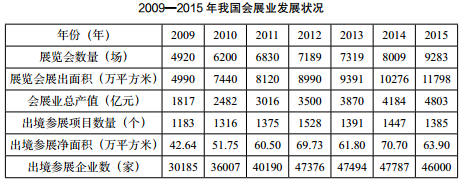 
>
> 【例 2】  (2019 北京)以下哪项的折线图可以准确表现 2011~2014 年间， 我国会展业总产值同比增量的变化情况(单位:亿元)?
>
> A. 
>
> B.  
>
> C. 
>
> D. 

解析：增长量计算问题，选A

>  
>
> 【例 3】 (2018 北京)以下折线图反映的是哪个时间段 B 市城市和农村低保 总人数同比下降量的变化趋势? 
>
>  
>
> A.2010~2013 年 B.2011~2014 年
> C.2012~2015 年 D.2013~2016 年

解析：增长量计算类，选B

>  
>
> 【例 4】(2019 上海)2010~2015 年，我国城市天然气供气总量年均约增 长多少亿立方米?
>
> A.68 B.92
> C.111 D.191

解析：增长量计算类，套年均增长量计算公式，选C

> 2015 年末该市拥有技术企业 3478 家，人才总数由 2010 年末的 146 万人增 加到 2015 年末的 227 万人。其中，高层次人才由 2010 年末的 8 万人增加到 2015年末的 18 万人。每万名劳动者中研发人员由 158 人增加到 175 人。
>
> 【例 5】(2017 江苏)“十二五”期间(2011~2015 年)，该市人才总数 年平均增加人数是:
>
> A.13.6 万人 B.14.2 万人
> C.15.6 万人 D.16.2 万人

解析：增长量计算类，套年均增长量公式，选D

> 2018 年 9 月份，596 种产品中有 324 种产品同比增长。其中，钢材 9675 万 吨，同比增长 9.8%;水泥 20781 万吨，增长 5.0%;十种有色金属 456 万吨，增 长 5.8%;乙烯 161 万吨，增长 3.5%;汽车 242.6 万辆，下降 10.6%;轿车 102.8万辆，下降 8.6%;发电量 5483 亿千瓦时，增长 4.6%;原油加工量 5134 万吨， 增长 4.9%。
>
> 【例 6】 (2018 江西)2018 年 9 月水泥产量比 2017 年同期增加约:
> A.990 万吨 B.1039 万吨
> C.864 万吨 D.948 万吨

解析：增长量计算类，选A

> 2018 年 1~7 月份，全国网上零售额 47863 亿元，同比增长 29.3%。其中， 实物商品网上零售额 36461 亿元，同比增长 29.1%，占社会消费品零售总额的比 重为 17.3%;在实物商品网上零售额中，吃、穿和用类商品分别同比增长 41.6%、29.9%和 29.7%。
>
> 【例 7】(2018 辽宁)2018 年 1~7 月份，实物商品网上零售额同比增长约 多少亿元?
>
> A.8128
>
> B.7256
>
> C.9133
>
> D.8977

解析：增长量计算类，选A

> 2017 年我国粮食产量 61791 万吨，比上年增加 166 万吨，增产 0.3%。其中， 夏粮产量 14031 万吨，增产 0.8%;早稻产量 3174 万吨，减产 3.2%;秋粮产量44585 万吨，增产 0.4%。全年谷物产量 56455 万吨，比上年减产 0.1%。其中， 稻谷产量 20856 万吨，增产 0.7%;小麦产量 12977 万吨，增产 0.7%;玉米产量21589 万吨，减产 1.7%。全年棉花产量 549 万吨，比上年增产 3.5%。油料产量3732 万吨，增产 2.8%。糖料产量 12556 万吨，增产 1.7%。茶叶产量 255 万吨， 增产 6.0%。
>
> 【例 8】(2018 广州)2017 年，我国棉花的产量比 2016 年约增产了多少万 吨?
>
> A.7 B.19
> C.31 D.48

解析：增长量计算类，选B

> 【例 9】(2017 联考)2015 年全国共建立社会捐助工作站、点和慈善超市3.0 万个，比上一年减少 0.2 万个，其中:慈善超市 9654 个，同比下降 5.1%。
>
> 2015 年，全国建立的慈善超市较 2014 年约:
> A.增加 519 个 B.减少 519 个
> C.增加 686 个 D.减少 686 个

解析：增长量计算类，选B

> 【例 10】(2019 北京)2017 年上半年，B 市规模以上文化创意产业法人单 位、战略性新兴产业法人单位、高技术服务业法人单位分别实现收入 6902.7 亿 元、3870.0 亿元和 6924.9 亿元，同比分别增长 8.6%、12.6%和 9.1%。
>
> 2017 年上半年，B 市规模以上文化创意产业法人单位实现收入同比增量约是 战略性新兴产业法人单位的多少倍?
>
> A.0.7 B.1.3
> C.1.8 D.2.6

解析：增长量计算类，选B

>  
>
>   

#### 比较
  - 识别:增长最多/少。
  - 速算: 
     - 给出每年数据:直接两两相减，柱状图还可用直尺标注
     - 给现期和 r:两者都大则增量必然大，否则百化分计算

>  
>
> 【例 1】(2018 浙江)将以下年份按年末网民人数同比增量从多到少排序， 正确的是:
>
> A.2006 年>2007 年>2008 年>2009 年
>
> B.2009 年>2008 年>2007 年>2006 年
>
> C.2006 年>2007 年>2009 年>2008 年
>
> D.2008 年>2009 年>2007 年>2006 年

解析：增长比较问题，选D

>  
>
> 【例 2】 (2018 北京)该市以下 4 个产业中，哪个产业 2016 年增加值增量最高?
> A.医药制造业 B.非金属矿物制品业
> C.汽车制造业 D.电力、热力生产和供应业

解析：增长比较问题，选C

>  
>
> 【例 3 (2016 福建事业单位)2015 年各季度，电子计算机行业销售产值比上年增加最多的是:
> A.第一季度 B.第二季度
> C.第三季度 D.第四季度 

解析：增长比较问题，选A

>  
>
> 【例 4】(2018 山东)2017 年 4 月份，表中各类商品限额以上单位零售额 同比增量最多的是:
>
> A.服装鞋帽、针纺织品 B.石油及制品
> C.汽车 D.家用电器和音像器材

解析：增长比较类，选C

## 比例相关

### 比重

- 术语
  - 增长贡献率：部分增量在总体增量中所占的比例
  - 资料分析中的利润率：利润在**收入**中的占比
- 现期比重
  - 识别:问题时间与材料一致，……占……的比重
  - 公式:
    - 比重=部分/总体
    - 部分=总体*比重
    - 总体=部分/比重
  - 速算:截位直除法

> 2017 年全国居民人均可支配收入 25974 元，比上年增长 9.0%，扣除价格因 素，实际增长 7.3%。2017 年全国居民人均消费支出 18323 元，比上年增长 7.1%， 扣除价格因素，实际增长 5.4%。
>
>  
>
> 【例 1】(2018 江西)2017 年教育文化娱乐支出占居民人均可支配收入的百 分比是:
>
> A.8% B.9%
> C.10% D.11%

解析：现期比重问题，选A

> 2016 年全国餐饮收入 35799 亿元，同比增长 10.8%，餐饮收入占社会消费品 零售总额的比重为 10.8%。2016 年全社会餐饮业经营单位为 365.5 万个，同比下 降 8.2%;从业人数为 1846.0 万人，同比增长 5.7%。
>
> 【例 2】 (2019 北京)2016 年社会消费品零售总额约为多少万亿元?
> A.27 B.33
> C.39 D.45

解析：现期比重，选B

> 为了解市民家庭存书(不含教材教辅)阅读和共享意愿情况，某市统计局成 功访问了 18 岁以上的常住市民 2007 人。调查显示，关于家庭存书共享意愿的问 题，选择“无条件愿意”“有条件愿意”“不愿意”“不知道/不清楚”的受访市民 所占比重分别是 60.8%、15.1%、20.6%、3.5%。
>
>  
>
> 【例 3】 (2018 江苏)家庭存书超过 300 册的受访市民人数为:
> A.134 B.247
> C.616 D.805

解析：现期比重问题，选B

> 2016 年 1 季度，全国规模以上文化及相关产业企业共 4.7 万家，实现营业 收入 16719 亿元，比上年同期增长 8.6%，增速比上年全年增速提高 1.7 个百分 点。
>
>  
>
> 【例 4】 (2017 山东)以下哪个饼图能够最准确地反映全国各地区 2016 年 1季度规模以上文化及相关产业营业收入的比重关系?
>
>  

解析：现期比重问题，选A

> 2015 年我国钟表行业规模以上工业企业主营业务收入 365.8 亿元，同比增 长 8.7%;实现利润 23.4 亿元，与上年相比下降 1.5%，而 2015 年轻工行业主营 业务利润率(利润/主营业务收入)的平均水平为 7.57%。
>
> 【例 5】(2017 国考)2015 年我国钟表行业规模以上工业企业主营业务利润 率比轻工行业平均水平:
>
> A.低 3 个百分点 B.高 3 个百分点
> C.低 1.2 个百分点 D.高 1.2 个百分点

解析：现期比重问题，选C

- 基期比重
  - 识别:问题时间在材料之前，占，比重
  - 公式
    - $$\frac{A}{1+a}\div \frac{B}{1+b}=\frac{A}{B}\times \frac{1+b}{1+a}$$
  - 速算:
    - 截位直除;
    - 先计算现期比重，再判断大小

> 2016 年江苏规模以上光伏产业总产值 2846.2 亿元，比上年增长 10.8%，增速较上年回落 3.5 个百分点;主营业务收入 2720.5 亿元，增长 9.9%，增速回落2.5 个百分点;利润总额 153.6 亿元，增长 11.6%，增速回落 8.8 个百分点。苏 南、苏中、苏北地区规模以上光伏产业产值分别比上年增长 10.2%、9.0%、39.0%。2016 年江苏光伏发电新增装机容量 123 万千瓦，年末累计装机容量 546 万千瓦。
>
>  
>
> 【例 1】(2018 江苏)2015 年苏中地区规模以上光伏产业产值占全省的比重 为:
>
> A.19.0% B.23.5%
> C.28.3% D.33.1%

解析：基期比重问题，选D

> 2015 年 1—2 月社会消费品零售总额主要数据
>
>  
>
>  
>
> 【例 2】(2015 河北)2014 年 1~2 月份网上商品零售额占社会消费品零售 额的比重是:
>
> ​    A.6.25%                        B.8.11%
> ​    C.8.32%                        D.10.70%

解析：现期比重，注意有猜题方法[^3]，选A

- 两期比重
  - 识别:两个年份、一个比重
  - 公式
    - 比重变化=$$\frac{A}{B}\times \frac{a-b}{1+a}$$
  - 升降判断
    - 若A的增速>B的增速，比重增加；反之，减少 
  - 速算:比重差一定小于增长率之差，即 A/B*[(a-b)/(1+a)]<|a-b|[^5]

> 2017 年 1~4 月，S 市对欧盟进出口总值为 802.6 亿元人民币，比去年同期 (下同)增长 7.7%，占我国对欧盟进出口总值的 6.5%。
>
> 1~4 月，在欧盟前 5 大贸易国中，S 市对德国进出口 164.3 亿元，增长 7.6%; 对英国进出口 123 亿元，增长 3.1%;对荷兰进出口 108.1 亿元，增长 12.1%;对 意大利进出口 61.4 亿元，增长 10.3%;对法国进出口 81.1 亿元，下降 4.3%。同 期，对“一带一路”沿线欧盟国家进出口 113.5 亿元，增长 11.3%。
>
> 【例 1】(2018 广西)2017 年 1~4 月 S 市对欧盟前 5 大贸易国中，进出口 总值占 S 市对欧盟进出口总值比重高于上年同期水平的有几个?
>
> A.1 B.2
> C.3 D.4

解析：两期比重问题，选B

> 2018 年 1~3 月，国内手机市场出货量 8737.0 万部，同比下降 26.1%。4G手机出货量 8195.6 万部，同比下降 27.1%;国产品牌手机出货量 7586.4 万部， 同比下降 27.8%;智能手机出货量 8187.0 万部，同比下降 27.0%。
>
> 【例 2】(2018 四川下)在1国内 4G 手机出货量、2国产品牌手机出货量、 3智能手机出货量中，2018 年 1~3 月出货量占全国手机出货量比重高于上年水 平的有几类?
>
> A.0 B.1
> C.2 D.3

解析：两期比重问题，选A，*这题有点小问题*

> 2015 年，纺织行业规模以上企业累计实现主营业务收入 70713 亿元，同比 增长 5.0%;实现利润总额 3860 亿元，同比增长 5.4%;企业亏损面(亏损企业占 所有企业比重)11.4%。比上年低 0.1 个百分点。
>
> 【例 3】(2017 重庆)2015 年，纺织行业规模以上企业主营业务利润率(利 润总额/主营业务收入)比上年约:
>
> A.上升 0.02 个百分点 B.上升 0.4 个百分点
> C.下降 0.02 个百分点 D.下降 0.4 个百分点

解析：两期比重问题，选A，有技巧[^4]

> 国家统计局公布的全国粮食生产数据显示，2018 年全国粮食播种面积175555 万亩，比 2017 年下降 0.8%。全国粮食单位面积产量 375 公斤/亩，比 2017年增长 0.2%。谷物单位面积产量 408 公斤/亩，比 2017 年增长 0.3%。粮食总产量 6579 亿公斤，比 2017 年下降 0.6%;其中谷物(包括稻谷、小麦、玉米、大 麦、高粱、荞麦、燕麦等)总产量 6102 亿公斤，比 2017 年下降 0.8%。全年粮 食产量虽有所下降，但减幅不大，仍处于高位水平，属于丰收年景。
>
> 【例 4】(2018 辽宁)2018 年全国谷物总产量占全国粮食总产量的比重，较 上一年约:
>
> A.增长 0.19% B.减少 0.19%
> C.增长 0.26% D.减少 0.26%

解析：两期比重问题，选B

### 平均数

- 现期平均: 
  - 识别
    - 问题时间与材料一致+平均(均/每/单位)
  - 公式
    - 平均数=总数/个数
    - 后面/前面[^6]
  - 技巧
    - 截位直除法
    - 削峰填谷[^7]

> 2014 年我国粮食种植面积 11274 万公顷，比上年增加 78 万公顷。棉花种植 面积 422 万公顷，减少 13 万公顷。油料种植面积 1408 万公顷，增加 6 万公顷。糖料种植面积 191 万公顷、减少 9 万公顷。全年粮食产量 60710 万吨，比上年增 加 516 万吨，增产 0.9%。
>
> 【例 1】(2017 河南)2014 年，我国粮食单位种植面积的产量约为( )吨/公顷。
>
> A.3.9 B.4.4
> C.4.9 D.5.4

解析：现期平均，选D

> 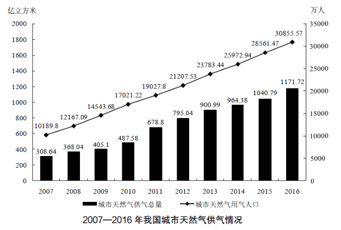 
>
> 【例 2】(2019 上海)2016 年我国城市天然气用气人口中，平均每人每月使 用天然气约多少立方米?
>
> A.32 B.65
> C.167 D.380

解析：现期平均数，选A

> 2017 年 1~4 月，S 市对欧盟进出口总值为 802.6 亿元人民币，比去年同期 (下同)增长 7.7%，占我国对欧盟进出口总值的 6.5%。其中，对欧盟出口 621.2亿元，增长 5.9%，占我国对欧盟出口总值的 8.3%;自欧盟进口 181.4 亿元，增 长 14.5%。
>
> 【例 3】(2018 广西)2017 年 1~4 月，我国平均每月对欧盟进出口总值约 为多少万亿元?
>
> A.0.3 B.0.5
> C.0.8 D.1.2

解析：现期平均数，选A

> 2017 年，某省全省园林水果面积 1987.30 万亩，比上年增长 4.8%。其中， 苹果的挂果面积为 726.21 万亩，同比增长 4.1%;梨的挂果面积为 61.29 万亩， 同比增长-1.0%;桃的挂果面积为 45.05 万亩，同比增长 5.8%;猕猴桃的挂果面 积为 64.76 万亩，同比增长 10.8%。
>
> 2017 年，该省全省园林水果产量 1801.02 万吨，增长 5.1%。其中，苹果的 产量为 1153.94 万吨，同比增长 4.8%;梨的产量为 110.37 万吨，同比增长 5.9%; 桃的产量为 84.61 万吨，同比增长 7.4%;猕猴桃的产量为 138.97 万吨，同比增 长 5.9%。
>
> 【例 4】 (2018 陕西)2017 年，该省单位面积产量最高的水果是( )。
>
> A.梨 B.苹果
> C.桃 D.猕猴桃

解析：现期平均数比较，选D

> 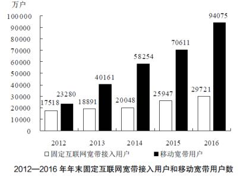 
>
> 【例 5】 (2018 联考)2012~2016 年期间，我国固定互联网宽带接入用户的 平均数是:
>
> A.18425 万户
>
> B.22425 万户
>
> C.25425 万户 
>
> D.27425 万户

解析：现期求平均数，选B

> 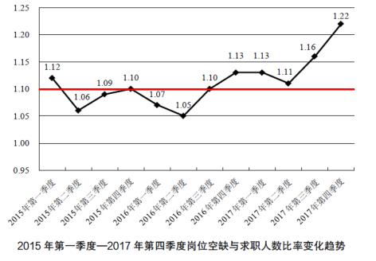 
>
> 【例 6】 (2018 广东)2015—2017 年，各季度的岗位空缺与求职人数比率的 平均值约为( )。
>
> A.1.07 B.1.09
> C.1.11 D.1.13

解析：现期求平均数，削峰填谷，选C

- 基期平均: 
  - 识别:问题时间在材料前+平均(均/每/单位) 
  - 公式
    - $$\frac{A}{1+a}\div \frac{B}{1+b}=\frac{A}{B}\times \frac{1+b}{1+a}$$
  - 速算:
    - 截位直除
    - 先计算现期平均，再判断大小

> 2015 年第一季度，A 省商品房销售面积 1175.2 万平方米，下降 13.4%，降 幅比 1~2 月份收窄 13.8 个百分点。其中，商品住宅销售面积 1036.3 万平方米， 下降 15%。商品房销售额 608 亿元，下降 13.8%，降幅比 1~2 月份收窄 12.3 个百分点。其中，商品住宅销售额 505.5 亿元，下降 16.2%。
> 【例 1】 (2015 许昌事业单位) 2014 年第一季度 A 省商品住宅平均每平方米售价约为( )元。
> A.4948 B.4828
> C.4515 D.4440

解析：基期平均，选A

- 两期平均: 
  - 识别:题干中涉及两个时间+平均(均/每/单位)
  - 公式
    - $$\frac{A}{B}\times \frac{a-b}{1+a}$$
  - 升降判断:看分子分母增长率，分子大则升，小则降 
  - 平均数的增长率:
    - 先找出分子增速 a 和分母的增速 b
    - 代入公式:(a-b)/(1+b)

>  
>
> 【例 1】 (2015 甘肃)在东部、中部、西部地区中，2014 年 1~2 月商品房平均 销售价格高于上年同期水平的地区有几个?
>
> A.2 B.3
> C.0 D.1

解析：两期平均，选D

> 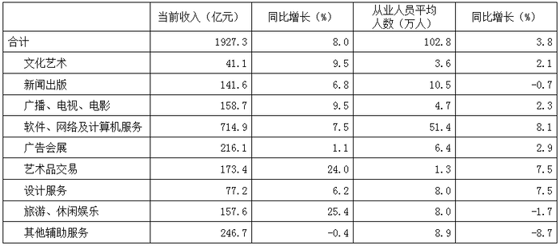 
>
> 【例 2】 (2014 黑龙江)以下各项中，2013 年第一季度平均每名从业人员创 造的收入均高于上年水准的是:
>
> A.新闻出版，广播、电视、电影，旅游、休闲娱乐
>
> B.新闻出版，广告会展，其他辅助服务
>
> C.广播、电视、电影，艺术品交易，设计服务
>
> D.文化艺术，软件、网络及计算机服务，艺术品交易

解析：基期平均数比较，选A

> 2017 年，A 省完成客运总量 148339 万人次，同比增长 5.4%，增幅比前三季 度提高 0.2 个百分点，比上年提高 0.5 个百分点;完成旅客周转总量 4143.84亿人公里，增长 7.7%，增幅比前三季度提高 0.7 个百分点，比上年提高 1.8 个 百分点。
>
> 【例 3】(2019 国考)2017 年前三季度，A 省平均每人次客运旅客运输距离 (旅客周转量÷客运总量)同比:
>
> A.下降了不到 2% B.下降了 2%以上
> C.上升了不到 2% D.上升了 2%以上

解析：平均增长率问题，选C

> 2016 年全国餐饮收入 35799 亿元，同比增长 10.8%，餐饮收入占社会消费品 零售总额的比重为 10.8%。2016 年全社会餐饮业经营单位为 365.5 万个，同比下 降 8.2%;从业人数为 1846.0 万人，同比增长 5.7%。
>
> 【例 4】 (2019 北京)2016 年全社会餐饮业平均每个经营单位的从业人数比 上年约
>
> A.减少了 2% B.减少了 15%
> C.增加了 2% D.增加了 15%

解析：平均增长率问题，选D

### 倍数

- 现期倍数:
  - 识别:问题时间与材料一致，A 是 B 的多少倍
  - 公式:A/B
  - 速算:截位直除法

> 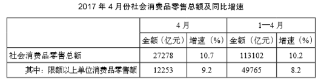 
>
> 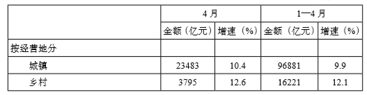 
>
> 【例 1】(2018 山东)2017 年 4 月份，城镇消费品零售额约是乡村消费品零 售额的多少倍?
>
> A.1.2 B.5.2
> C.5.9 D.6.2

解析：现期倍数，选D

> 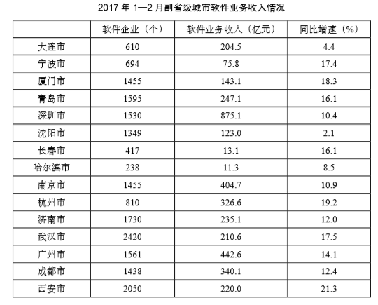 
>
> 【例 2】(2018 广西)2017 年 1~2 月，软件企业数量最多的副省级城市软 件业务收入约是软件企业数量最少的副省级城市的多少倍?
>
> A.5 B.8
> C.10 D.19

解析：现期倍数，直除，选D

> 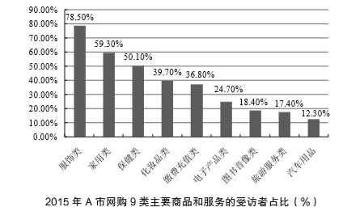 
>
> 【例 3】 (2016 吉林)受访者中，在 2015 年网购化妆品的人数约为网购旅游 服务人数的:
>
> A.1.0 倍 B.1.5 倍
> C.2.3 倍 D.2.5 倍

解析：现期倍数，选C

> 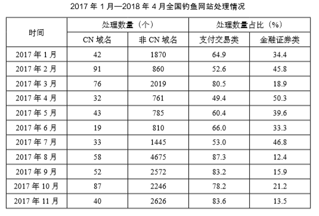 
>
> 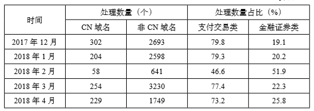 
>
> 【例 4】 (2019 国考)2017 年，全国处理的支付交易类钓鱼网站数量超过金融证券类钓鱼网站 2 倍的月份有几个?
>
> A.5 B.6
> C.7 D.8

解析：现期倍数，选B

> 【例 5】 (2018 江苏)为了解市民家庭存书(不含教材教辅)阅读和共享意 愿情况，某市统计局成功访问了 18 岁以上的常住市民 2007 人。调查显示，关于 家庭存书共享意愿的问题，选择“无条件愿意”“有条件愿意”“不愿意”“不知 道/不清楚”的受访市民所占比重分别是 60.8%、15.1%、20.6%、3.5%。
>
> 选择“无条件愿意”共享家庭存书的受访市民比选择“有条件愿意”的多:
>
> A.5 倍 B.4 倍
> C.3 倍 D.2 倍

解析：现期倍数，选C

- 基期倍数:
  - 识别:问题时间在材料之前，A 是 B 的多少倍 
  - 公式:A/(1+a)÷[B/(1+b)]=A/B*[(1+b)/(1+a)] 
  - 速算:
    - 截位直除
    - 先算现期倍数，再判断大小

> 【例 1】(2019 国考)2017 年，A 省完成高铁客运量 17872 万人次，旅客周 转量 474.64 亿人公里，同比分别增长 20.3%和 18.1%。高铁客运量和旅客周转量 分别占铁路旅客运输总量的 62.7%和 54.3%，比重比上年分别提高 4.3 个和 3.9个百分点。
>
> 2016 年，A 省高铁客运量约是普铁(除高铁外的铁路)客运量的多少倍?
>
> A.1.4 B.1.7
> C.0.8 D.1.1

解析：基期倍数，选A

> 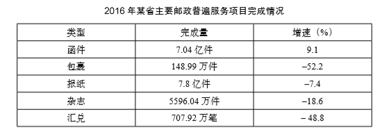 
>
> 【例 2】 (2017 广东)2015 年该省报纸的订销完成量约是杂志的多少倍?
>
> A.12.3 B.13.9
> C.15.1 D.16.7

解析：基期倍数，选A

- 倍数与增长:
  - A 是 B 的 n 倍:正常情况的普通倍数，n=A/B 
  - A 比 B 增长(多)r 倍:本质为增长率，r=A/B-1

## 特殊增长率

### 间隔增长率
- 题型识别
  - 中间隔一年求，增长率。 
- 公式
  - r=r1+r2+r1*r2，中间只能隔一年
- 速算技巧
  - r1、r2 绝对值均小于 10%，结合选项 r1*r2 可忽略。
  - 化成分数

> 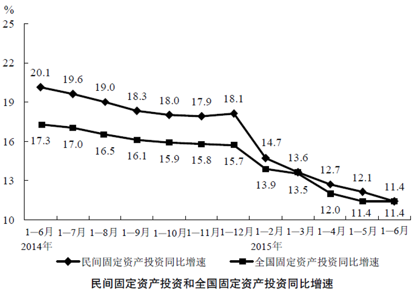 
>
> 【例 1】 (2016 北京)与 2013 年上半年相比，2015 年上半年全国固定资产投资 约上升了:
>
> A.11.4% B.17.3%
> C.28.7% D.30.7%

解析：间隔增长率，选D

> 2016 年 1~4 月份，我国全社会用电量 18093 亿千瓦时，同比增长 2.9%。从 不同产业看，第一产业用电量 270 亿千瓦时，同比增长 9.1%;第二产业用电量12595 亿千瓦时，同比增长 0.2%;第三产业用电量 2516 亿千瓦时，同比增长 10.0%， 增速比上年同期提高 2.1 个百分点;城乡居民生活用电量 2711 亿千瓦时，同比 增长 9.5%，增速比上年同期提高 5.4 个百分点。
>
> 例 2 (2017 山东)与 2014 年同期相比，2016 年 1~4 月份第三产业用电量 上升了约( )。
>
> A.15% B.19%
> C.23% D.27%

解析：间隔增长率，选B

> 2015 年我国钟表全行业实现工业总产值约 675 亿元，同比增长 3.2%，增速 比上年同期提高 1.7 个百分点。
>
> 全行业全年生产手表 10.7 亿只，同比增长 3.9%，完成产值约 417 亿元，同 比增长 4.3%，增速提高 1.9 个百分点;生产时钟(含钟芯)5.2 亿只，同比下降3.7%，完成产值 162 亿元，同比下降 4.7%，降幅扩大 1.3 个百分点。
>
> 例3(2017国考)2015年我国钟表全行业生产时钟(含钟芯)的产值与2013年相比约( )。
>
> A.上升了 11% B.下降了 11%
> C.上升了 8% D.下降了 8%

解析：间隔增长率，选D

> 2017 年上半年医药工业规模以上企业实现主营业务收入 15314.40 亿元，同 比增长 12.39%，增速较上年同期提高 2.25 个百分点。
>
> 例 4(2017 新疆)在医药工业规模以上企业实现主营业务收入上，2017 年 上半年约是2015年上半年的( )。
>
> A.1.13 倍 B.0.13 倍
> C.1.24 倍 D.0.24 倍

解析：间隔增长率，选C

> 2013 年 3 月末，金融机构人民币各项贷款余额 65.76 万亿元，同比增长 14.9%， 增速比上年同期低 0.8 个百分点。
>
> 例 5(2014 联考)2013 年 3 月末，金融机构人民币各项贷款余额约是 2011年同期的多少倍?
>
> A.1.1
>
> B.1.2
>
> C.1.4 
>
> D.1.3

解析：间隔增长率，选D

> 2017 年第一季度，某省农林牧渔业增加值 361.78 亿元，比上年同期增长 5.9%， 高于上年同期 0.2 个百分点。
>
> 例 6(2018 联考)2015 年第一季度，该省农林牧渔业增加值与下列哪一项 最为接近?
>
> A.320 亿元 B.340 亿元
> C.360 亿元 D.380 亿元

解析：间隔增长率，和基期增长量混合的问题，间隔增长率约为11.6%，约为1/9，361.78/(10/9)，选A	

> 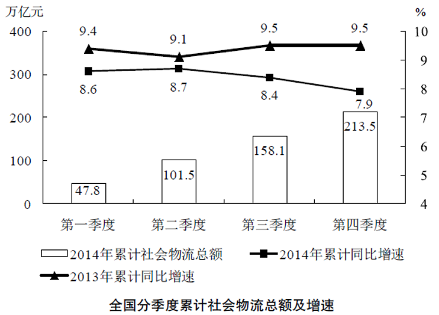 
>
> 例 7(2016 国考)2012 年上半年全国社会物流总额约为多少万亿元?
>
> A.75 B.86
> C.93 D.102

解析：间隔增长率，基期量问题，101.5/（1+17.8%），选B

### 年均增长率
- 题型识别
  - 年均增长最快、年均增速排序
- 公式
  - (1+r)n=现期量/基期量(n 为现期和基期的年份差)
- 比较方法
  - 比较“现期量/基期量”(n 相同)
> 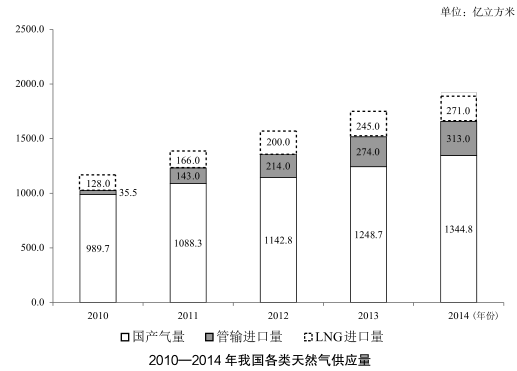
>
> 【例 1】(2017 广州)2010—2014 年，我国各类天然气供应量年均增速由高 到低排列正确的是:
>
> A.管输进口量、LNG 进口量、国产气量
> B.国产气量、LNG 进口量、管输进口量
> C.国产气量、管输进口量、LNG 进口量
> D.LNG 进口量、国产气量、管输进口量 

解析：出现年均增速关键字，为特殊增长率中的年均增长率问题，选A

> 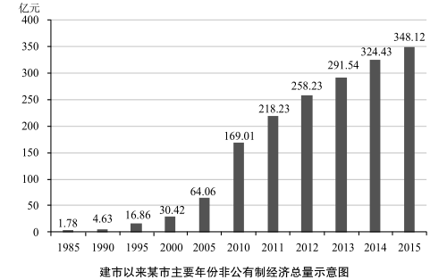 
>
> 【例 2】(2016 四川)以下各时间段中，该市非公有制经济增加值年均增速 最快的是:
>
> A.1990~1995 年 B.1995~2000 年
> C.2000~2005 年 D.2005~2010 年

解析：年均增长率问题，选A

> 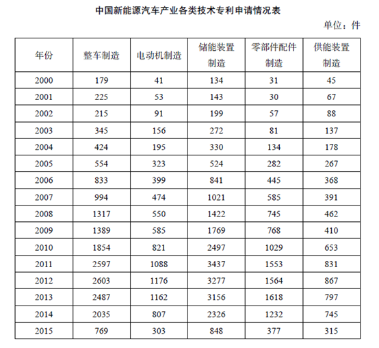 
>
> 【例 3】(2017 国考)能够从上述资料中推出的是:
>
> A.2000~2015 年间，五种技术专利中申请数年均增速最快的是零部件配件 制造
>
> B.略
> C.略
> D.略

解析：年均增长率问题，选A

### 混合增长率
- 题型识别
  - 部分增速与整体增速之间的关系
- 口诀
  - 居中但不中;
  - 偏向基数较大的

> 2017 年上半年，B 市科学研究和技术服务业实现增加值 1211.8 亿元，同比 增长 10.0%，比一季度增幅扩大 1.4 个百分点。
>
> 【例 1】(2019 北京)2017 年第二季度，B 市科学研究和技术服务业实现增 加值的同比增速的范围是:
>
> A.小于 8.6% B.等于 8.6%
> C.大于 8.6%且小于等于 10% D.大于 10%

解析：混合增长率，选D

> 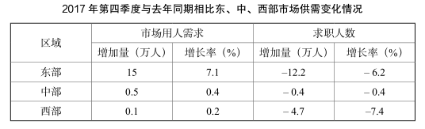 
>
> 【例 2】(2018 广东)2017 年第四季度求职人数比 2016 年第四季度下降了 约:
>
> A.5% B.8%
> C.10% D.12%

解析：混合增长率，选A

> 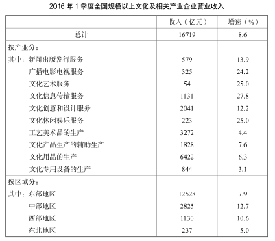 
>
> 【例 3】(2017 山东)合并计算 2016 年 1 季度营业收入最高的两个产业，其 营业收入总体增速最接近以下哪个数字?
>
> A.4.4 B.5.1
> C.5.7 D.6.4

解析：混合增长率，选出比重最大的两项，取平均值，选C

> 2017 年，A 省完成邮电业务总量 6065.71 亿元。其中，电信业务总量 3575. 86 亿元，同比增长 75.8%;邮政业务总量 2489.85 亿元，增长 32.0%。
>
> 【例 4】(2019 国考)2017 年 A 省邮电业务总量同比增速在以下哪个范围之 内?
>
> A.低于 25% B.25%~50%之间
> C.50%~75%之间 D.超过 75%

解析：混合增长率，选C

> 2018 年 3 月，国产品牌手机出货量 2699.5 万部，同比下降 29.0%。1—3 月， 国产品牌手机出货量 7586.4 万部，同比下降 27.8%。
>
> 【例 5】(2018 四川下)2018 年 1~2 月，国产品牌手机出货量同比约下降 了:
>
> A.25.5% B.26.6%
> C.27.1% D.28.4%

解析：混合增长率，选C

## 其他考点

### 简单计算

- 直接找数
  - 注意范围等表述陷阱

> 2015 年上半年全国水产品对美国、欧盟、东盟、日本、中国香港、韩国和 中国台湾的出口额分别增长-2.49%、-5.04%、31.26%、-1.37%、-18.94%、-11. 67%和 4.43%。
>
> 【例 1】(2017 北京)材料中所列水产品主要出口国家和地区中，2015 年 上半年我国对其出口额同比降幅最大的是:
>
> A.东盟 B.韩国
> C.中国香港 D.日本

解析：直接找数，选C

> 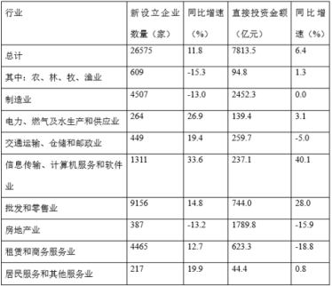 
>
> 【例 2】(2017 北京)表中有几个行业在新设立企业数和直接投资金额同比 增速上均快于全国总体水平?
>
> A.4 B.3
> C.2 D.1

解析：直接找数，选C

> 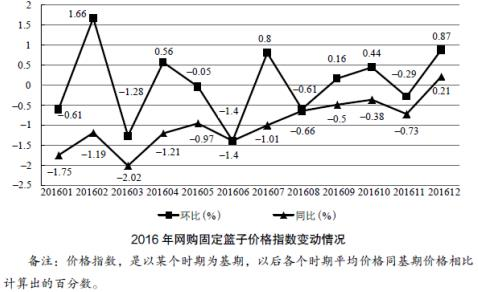 
>
> 【例 3】(2018 广西)2016 年上半年网购固定篮子价格指数环比下跌的月份 有几个?
>
> A.3 B.4
> C.5 D.6

解析：直接找数，选B

- 简单加减
    - 选项与材料精度相同:尾数法 
    - 选项与材料精度不同:估算 

> 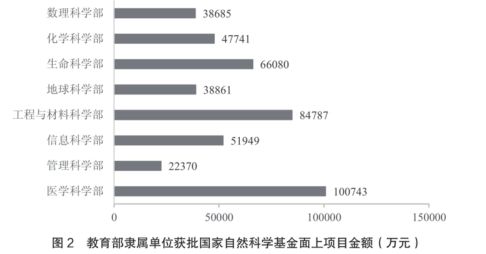 
>
> 【例 4】(2017 江苏)2016 年教育部隶属单位获批国家自然科学基金面上项 目的总金额是:
>
> A.451216 万元 B.462158 万元
> C.446354 万元 D.446893 万元

解析：简单加减，选A

> 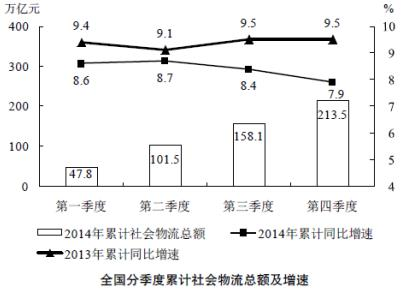 
>
> 【例 5】 (2016 国考)2014 年全国社会物流总额最高的季度是:
>
> A.第一季度 B.第二季度
> C.第三季度 D.第四季度

解析：简单加减，选C

> 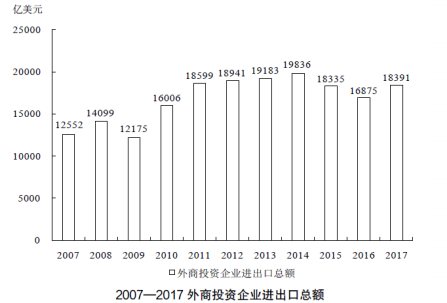 
>
> 【例6】(2018辽宁)十二五时期，我国外商投资企业进出口总额约为( ) 万亿美元。
>
> A.7.34 B.7.98
> C.9.26 D.9.49

解析：简单加减，选D 

- 排序题
  - 时间、单位、主体、顺序

> 2017 年上半年，分功能区看，上半年文创功能区规模以上法人单位实现收 入 5087.5 亿元，同比增长 9.7%。其中，文化科技融合示范区实现收入 2616.1亿元，同比增长 13.5%;时尚创意功能区、文化体育(会展)融合功能区、文化 艺术品交易功能区分别实现收入 187.9 亿元、167.5 亿元、52.2 亿元，同比分别 增长 28.6%、24.1%和 20.7%，均呈快速增长态势。
>
> 【例 7】(2018 新疆兵团)设 Y 市文化科技融合示范区、时尚创意功能区、 文化体育(会展)融合功能区和文化艺术品交易功能区规模以上法人单位 2017年上半年收入同比增长率分别为 X、Y、Z 和 N，则以下正确的是:
>
> A.X>Y>Z>N B.X>N>Z>Y
> C.Y>Z>X>N D.Y>Z>N>X

解析：排序题，选D

> 2015 年中国各地区机场旅客吞吐量的分布情况是:华北地区占 15.8%，比上 年降低 0.5 个百分点;东北地区占 6.0%，降低 0.1 个百分点;华东地区占 29.0%， 提高 0.2 个百分点;中南地区占 23.7%，降低 0.6 个百分点;西南地区占 16.8%， 提高 0.6 个百分点;西北地区占 5.9%，提高 0.2 个百分点;新疆地区占 2.8%， 提高 0.2 个百分点。
>
> 【例 8】 (2017 江苏)2014 年中国机场旅客吞吐量位于前三位的地区依次是:
>
> A.华北地区、中南地区、西南地区
>
> B.中南地区、华北地区、西南地区
>
> C.中南地区、华东地区、西南地区
>
> D.华东地区、中南地区、华北地区

解析：排序题，选D

> 2012 年全国国道网车流量较大的地区主要集中在北京、天津、上海、江苏、 浙江、广东和山东，上述省市国道网的日平均交通量均超过 2 万辆。全国国道网 日平均行驶量为 244883 万车公里，北京、天津、河北、山西、上海、浙江、湖 北、广东的国道年平均拥挤度均超过 0.6。其中，国家高速公路日平均交通量为22181 辆，日平均行驶量为 148742 万车公里;普通国道日平均交通量为 10845辆，日平均行驶量为 111164 万车公里。全国高速公路日平均交通量为 21305 辆， 日平均行驶量为 204717 万车公里。
>
> (注:交通拥挤度指公路上某一路段折算交通量与适应交通量的比值，反映 交通的繁忙程度。)
>
> 【例 9】 (2014 国考)以下关于 2012 年日平均行驶量由高到低排序正确的是:
>
> A.国家高速公路—全国高速公路—普通国道
>
> B.全国高速公路—国家高速公路—全国国道网
>
> C.全国国道网—普通国道—国家高速公路
>
> D.全国国道网—国家高速公路—普通国道

解析：排序题，选D

### 综合分析

- 做题顺序:先看 C、D 项，再看 A、B 项
- 陷阱类型:
   - 时间陷阱:时间段是否和材料一致
   - 主体陷阱:主体是否和材料一致 
   - 单位陷阱:简单计算时，需要谨慎
   - 概念陷阱:
      - 近、将近→小于但很接近，比如这次考试将近 100 分，指接近但不到 100 
      - 超过→大于
      - 约→可大可小，如这次考试约考了 90 分，是 90 分左右，可能是 89.5 分，也可能是 90.5 分
      - 持续增长、逐年增长→每一年都要比上一年增长
      - 增长趋势→一般看首尾，10000、2000、12000、8000、5000，趋势只看首尾，从 10000 到 5000 呈下降趋势
      - 说比重，必须要有部分与整体的关系，不能说男生占女生的比重
      - 不足一年→当年新增加的，2019 年学校新入学的同学有 100 人，= 2019 年入学不足 1 年的同学有 100 人
     - 最后注意(最关键):做题不要想当然，看清楚选对还是选错，读题时 先标出来，很多同学容易在此处掉坑

> 2017 年 1—2 月，全国造船完工 936 万载重吨，同比增长 123%;承接新船订 单 221 万载重吨，同比增长 133%。2 月末，手持船舶订单 9207 万载重吨，同比 下降 22.6%，比 2016 年末下降 7.6%。
>
> 2017 年 1—2 月，全国完工出口船 907 万载重吨，同比增长 127%;承接出口 船订单 191 万载重吨，同比增长 122%。2 月末，手持出口船订单 8406 万载重吨， 同比下降 25.9%。
>
> 2017 年 1—2 月，53 家重点监测的造船企业(以下简称重点企业)造船完工912 万载重吨，同比增长 133%。承接新船订单 197 万载重吨，同比增长 119%。2月末，手持船舶订单 8874 万载重吨，同比下降 23.1%。
>
> 2017 年 1—2 月，重点企业完工出口船 886 万载重吨，同比增长 138%;承接 出口船订单 171 万载重吨，同比增长 109%。2 月末，手持出口船订单 8129 万载 重吨，同比下降 26.6%。
>
> 例(2018国考)能够从上述资料中推出的是( )。
>
> A.2016 年末，重点企业手持船舶订单不到 9000 万载重吨
>
> B.2017 年 1~2 月，非重点企业承接出口船订单约 30 万载重吨
>
> C.2017 年 2 月末，重点企业手持船舶订单同比降幅低于全国平均水平
>
> D.2017 年 2 月末，重点企业手持出口船订单占全国比重低于上年同期

解析：选D

[^1]:高减低加，两年都是增长，2017比2016提高5%，计算2016年就要减去5%；
[^2]: 计算量较大，一般不这么用，而是分两步走，第一把r化成$$\frac{1}{n}$$，第二步，如果r是正，增长量是$$\frac{V_{present}}{n+1}$$，如果是负，增长量是$$\frac{V_{present}}{n-1}$$
[^3]: $$\frac{A}{1+a}\div \frac{B}{1+b}=\frac{A}{B}\times \frac{1+b}{1+a}$$，如果$$\frac{1+b}{1+a}$$的差距在个位数以内，则选小的，如果在20-30内，选最小的
[^4]: 有技巧，这种题直接选最小的
[^5]: 其实没什么用，直接选最小的，参照4
[^6]: 人均收入=收入/人数，收入在后，人数在前
[^7]: 三个人的成绩分别为 102、100、99，102比 100 多 2，99 比 100 少 1，补完之后还多出 1，平均分给 3 个人，每个人 0.33， 所以平均成绩为 100.33。

#### 百分化表格

##### GroupA

| 分数 | 百分数 |
| ---- | ------ |
| 1/2  | 50%    |
| 1/4  | 25%    |
| 1/8  | 12.5%  |

##### GroupB

| 分数 | 百分数 |
| ---- | ------ |
| 1/3  | 33.3%  |
| 1/6  | 16.7%  |
| 1/12 | 8.3%   |

##### GroupC

| 分数 | 百分数 |
| ---- | ------ |
| 1/5  | 20%    |
| 1/10 | 10%    |
| 1/20 | 5%     |

##### GroupD

| 分数 | 百分数 |
| ---- | ------ |
| 1/7  | 14.3%  |
| 1/14 | 7.1%   |
| 1/9  | 11.1%  |
| 1/11 | 9.1%   |

##### GroupE

| 分数 | 百分数 |
| ---- | ------ |
| 1/13 | 7.7%   |
| 1/15 | 6.7%   |
| 1/17 | 5.9%   |
| 1/18 | 5.6%   |
| 1/19 | 5.3%   |

