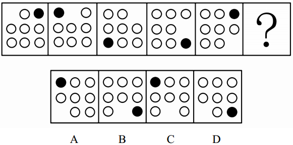
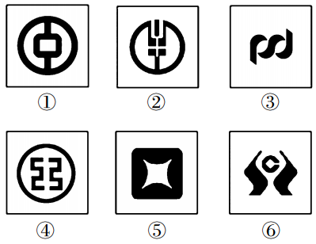
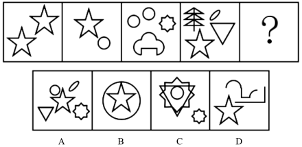
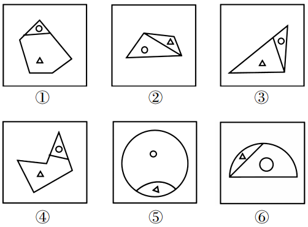
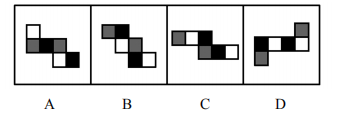

# 图形推理

## 平面推理综述

### 命题形式

两组图：有样学样

 

九宫格：发现规律，验证规律，套用规律，横看竖看，横看找出的规律优先

 

重点学习图形特征，例如什么样的特征图定位什么规律，学习解题思维非常关键。

1.元素相同:优先观察位置变化。

2.元素相似:优先观察样式变化。

3.元素不同:优先观察属性规律。

## 位置规律

### 平移

#### 1. 基础：考虑方向和步数

> 【例 1】 (2017 新疆兵团)根据所给图形的既有规律，选出一个最合理的答 案。
>
>  

解析：图形特征为有样学样，圆形的方向是顺时针，步长恒定为1，三角形的方向是对角线，步长恒定为1

> 【例 2】 (2017 国考)从所给的四个选项中，选择最合适的一个填入问号处， 使之呈现一定的规律性。
>
>  

解析：黑球逆时针移动，步长恒定为2，选C

#### 2. 延伸：方向的变形

##### 重合

 

##### 循环和反弹

- 循环（考察频率高）

 

- 反弹

 

>  

解析：图形推理，一组图，按顺序看，第一个黑球方向为对角线，步长恒定为1，循环运动轨迹，选A

> 【例 4】 (2016 云南)从所给的四个选项中，选择最合适的一个填入问号处， 使之呈现一定的规律性。
>
>  

解析：九宫格，规律为，球在三角形，三个边上上顺时针移动，且有一次会在某边外，选B

### 旋转、翻转

#### 1. 旋转考虑：方向和角度

> 【例 1】 (2015 山西)从所给的四个选项中，选择最合适的一个填入问号处， 使之呈现一定的规律性。
>
>  

解析：内部和外部旋转方向不同，旋转角度相同，选D

> 【例 2】 (2018 广东)从所给的四个选项中，选择最合适的一个填入问号处， 使之呈现一定的规律性。
>
>  

解析：按顺时针方向，每个小方块顺时针旋转，选B

#### 2. 翻转考虑：上下翻转，还是左右翻转

> 【例 3】 (2017 联考) 从所给的四个选项中，选择最合适的一个填入问号处， 使之呈现一定的规律性。
>
>  

解析：翻转，选A

> 【例 4】 (2018 浙江)从所给的四个选项中，选择最合适的一个填入问号处， 使之呈现一定的规律性。
>
>  

解析：竖着找规律，最后两个方块是上下翻转，选D

#### 3. 拓展

##### 上下不变，左右翻转

 

##### 上下对调，左右不变

 

##### 180 旋转:左右对调，上下对调

 

## 样式规律

### 加减同异

#### 1. 相加、相减

 

#### 2. 求异(保留不同)

 

#### 3.求同(保留相同)

 

> 【例 1】 (2018 广州)请选择最适合的一项填入问号处，使右边图形的变化 规律与左边图形一致。
>
>  

解析：样式规律，相减，选C

> 【例 3】 (2015 国考)从所给的四个选项中，选择最合适的一个填入问号处， 使之呈现一定的规律性。
>
>  

解析：样式规律，求异，选D

> 【例 4】 (2018 上海)下列选项中，符合所给图形的变化规律的是:
>
>  

解析：样式规律，求异，选D

### 黑白运算

#### 1. 特征

图形轮廓和分隔区域相同，黑块数量不同

#### 2.方法

- 相同位置运算
- 举例
  - 黑+白=白
  - 白+黑=白
  - 白+白=黑

> 【例 1】 (2017 国考)从所给的四个选项中，选择最合适的一个填入问号处， 使之呈现一定的规律性。
>
>  

解析：黑白规律，选A

> 【例 2】 (2018 辽宁)从所给的四个选项中，选择最合适的一个填入问号处， 使之呈现一定的规律性。
>
>  

解析：黑白规律，选D

## 属性规律

### 1.特征

 

### 2.方法

- 对称性
  - 识别轴对称与中心对称
    - 轴对称: 等边、等腰三角形、箭头、左右对称图形
    - 中心对称：正看倒看都一样
  - 对称轴的细化
    - 对称轴方向
    - 对称轴数量
    - 对称轴与图形关系
- 开闭性（考频低）
  - 全封闭： 
  - 全开放： 
- 曲直性
  - 全曲线： 
  - 全直线： 
  - 曲+直： 
  - 曲直与位置：

> 【例 1】 (2016 浙江)从所给的四个选项中，选择最合适的一个填入问号处， 使之呈现一定的规律性。
>
>  

解析：中心对称，选A

> 【例 2】 (2018 广州) 把下面的六个图形分为两类，使每一类图形都有各自 的共同特征或规律，分类正确的一项是:
>
>  
>
> A.123，456 B.125，346
> C.135，246 D.146，235

解析：中心对称，选D

> 【例 3】 (2015 国考)把下面的六个图形分为两类，使每一类图形都有各自 的共同特征或规律，分类正确的一项是:
>
>  
>
> A.156，234 B.135，246
> C.123，456 D.125，346

解析：中心对称，选D

> 【例 4】 (2016 国考)从所给的四个选项中，选择最合适的一个填入问号处， 使之呈现一定的规律性。
>
>  

解析：轴对称，选B

> 【例 5】 (2018 北京 )从所给的四个选项中，选择最合适的一个填入问号处， 使之呈现一定的规律性。
>
>  

解析：对称轴与图形关系，选D

> 【例 6】 (2019 国考) 从所给的四个选项中，选择最合适的一个填入问号处， 使之呈现一定的规律性。
>
>  

解析：对称轴与图形关系，选B

> 【例 1】 (2018 河北)把下面的图形分为两类，使每一类图形都有各自的共 同特征或规律，分类正确的一项是:
>
>  
>
> A.146，235 B.134，256
> C.125，346 D.135，246

解析：曲线，选C

> 【例 2】 (2017 山东)从所给的四个选项中，选择最合适的一个填入问号处， 使之呈现一定的规律性。
>
>  

解析：曲直关系，选C

> (2015 国考)把下面的六个图形分为两类，使每一类图形都有各自 的共同特征或规律，分类正确的一项是:
>
>  
>
> A.126，345 B.145，236
> C.125，346 D.123，456

解析：开闭，选B

## 数量规律

### 1.识别

元素组成不相同、不相似，属性没规律，数量规律明显

### 2.考点

#### 2.1 点

- 线与线的交点

- 特征图
  - 线条交叉明显
  - 乱糟糟一团线  
  - 切点、顶点较多  
- 点的细化考法
  - 曲直交点:出现数点特征图，但整体数点无规律，且存在曲直相交。 
  - 内外交点:出现数点特征图，但整体数点无规律，图形有内外
  - 内部线与外框交点:外框一致或相似，内部线条明显，且常规没规律

> 【例 1】 (2015 江苏)请从所给的四个选项中，选择唯一的一个答案，使之 呈现一定的规律性。
>
>  

解析：点的数量，选B

> 【例 2】 (2016 国考)把下面的六个图形分为两类，使每一类图形都有各自 的共同特征或规律，分类正确的一项是:
>
>  
>
> A.124，356 B.125，346
> C.134，256 D.136，245

解析：曲直交点，选D

> 【例 3】 (2018 广州)请选择最适合的一项填入问号处，使之符合之前四个 图形的变化规律。
>
>  

解析：切点，选D

#### 2.2 线

##### 考点

直线、曲线

##### 特征图

- 直线数特征图:多边形、单一直线
- 曲线数特征图:曲线图形(全曲线图、圆、弧)

##### 特殊考点

- 一笔画：图形由一笔画成，线条不能重复来回画。
  - 线条之间连通
  - 奇点数=0 或 2(奇点:发射出奇数条线的点）
- 多笔画
  - 笔画数=奇点数÷2(奇点数出来一定是偶数个)
- 如何识别

> 【例 1】 (2018 新疆兵团)从所给的四个选项中，选择最合适的一个填入问 号处，使之呈现一定的规律性。
>
>  

解析：一共11条线，选C

> 【例 2】 (2017 山东)把下面的六个图形分为两类，使每一类图形都有各自 的共同特征或规律，分类正确的一项是:
>
>  
>
> A.124，356 B.125，346
>
> C.136，245 D.156，234

解析：3条曲线，选B

> 【例 3】 (2015 江苏)请从四个选项中选出正确的一项，其特征或规律与题 干给出的一串符号的特征或规律最为相似。
>
>  
>
> 

解析：笔画数规律，选D

> 【例 4】 (2018 联考 )从所给的四个选项中，选择最合适的一个填入问号处， 使之呈现一定的规律性。 

解析：笔画数，选A

> 【例 5】 (2018 北京)从所给的四个选项中，选择最合适的一个填入问号处， 使之呈现一定的规律性。
>
>  

解析：笔画数，选A

#### 2.3 面

##### 面的概念

白色的封闭区域

##### 啥时数

- 图形被分割、封闭面明显
- 生活化图形、粗线条图形中留空白区域

##### 面的细化考法

- 面的形状
- 最大面的形状

> 【例 1】 (2018 四川)从所给的四个选项中，选择最合适的一个填入问号处， 使之呈现一定的规律性。
>
>  

解析：面的数量，选C

> 【例 2】 (2019 北京)从所给的四个选项中，选择最合适的一个填入问号处， 使之呈现一定的规律性。
>
>  

解析：面的形状和数量，选D

> 【例 3】 (2017 河南)从所给的四个选项中，选择最合适的一个填入问号处， 使之呈现一定的规律性。
>
>  

解析：面的数量和大面积的形状，选B

> 【例 4】 (2018 山东)从所给的四个选项中，选择最合适的一个填入问号处， 使之呈现一定的规律性。
>
>  

解析：面的数量和大面积的形状，选A

#### 2.4 素数量

##### 元素种类和个数

- 特征图：多个独立小图形

##### 部分数

- 特征图：生活化图形、黑色粗线条图形

> 【例 1】 (2017 天津)从所给的四个选项中，选择最合适的一个填入问号处， 使之呈现一定的规律性。
>
>  

解析：元素的种类的个数，选A

> 【例 2】 (2015 广东)从所给的四个选项中，选择最合适的一个填入问号处， 使之呈现一定的规律性。
>
>  

解析：元素种类的个数，选C

> 【例 3】 (2017 江西)从所给的四个选项中，选择最合适的一个填入问号处， 使之呈现一定的规律性。
>
>  

解析：元素种类的个数，选B

## 特殊规律

### 1.识别

黑点、白点、箭头、小图形

### 2.标记位置

上、下、左、右、内、外

### 3.标记图形

点、线、角、面

> 【例 1】 (2018 江西) 把下面的六个图形分为两类，使每一类图形都有各自 的共同特征或规律，分类正确的一项是:
>
>  
>
> A.124，356 B.145，236
> C.134，256 D.136，245

解析：标记角与标记线，选B

> 【例 2】 (2015 国考)把下面的六个图形分为两类，使每一类图形都有各自 的共同特征或规律，分类正确的一项是:
>
>  
>
> A.134，256 B.126，345
> C.135，246 D.156，234

解析：最长线，与最短线，选A

> 【例 3】 (2018 国考)把下面的六个图形分为两类，使每一类图形都有各自 的共同特征或规律，分类正确的一项是:
>
>  
>
> A.134，256 B.136，245
> C.123，456 D.135，246

解析：钝角与锐角，选A

> 【例 4】 (2018 浙江)把下面的六个图形分为两类，使每一类图形都有各自 的共同特征或规律，分类正确的一项是:
>
>  
>
> A.145，236 B.146，235
> C.124，356 D.156，234

解析：选C，重合与非重合面

> 【例 5】 (2017 国考)把下面的六个图形分为两类，使每一类图形都有各自 的共同特征或规律，分类正确的一项是:
>
>  
>
> A.134，256 B.125，346
> C.136，245 D.145，236

解析：面积大小，选A	

## 空间重构

### 1.相对面

##### 1.1 特征

两个相对面能且只能看到一个面

##### 1.2 应用

一组相对面同时出现的选项——排除

##### 1.3 展开图中如何判断相对面

1.同行或同列相隔一个面

 

2.Z 字形两端(紧邻 Z 字中线的面)

 

> 【例 1】 (2018 四川)左边给定的是纸盒外表面的展开图，下面哪一项能由 它折叠而成?
>
>  

解析：相对面，选C

> 【例 2】 (2014 联考) 如用白、灰、黑三种颜色的油漆为正方体盒子的 6个面上色，且两个相对面上的颜色都一样，以下哪一个不可能是该盒子外表面的 展开图?
>
>  

解析：选C

### 2.相邻面(公共边)

#### 2.1 特征

折叠前后相邻关系保持不变

构成直角的两个边是同一条边

#### 2.2 应用

(1)图形的相对位置。

 (2)画边法。

> 【例 1】 (2016 吉林) 左边给定的是纸盒的外表面，下面哪一项能由它折叠 而成?
>
>  

解析：选B

## 立体拼合、截面图与三视图

