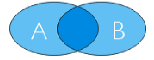

# 类比推理

### 重点

- 语义关系及常考的二级辨析 
- 并列关系中矛盾关系与反对关系的区分 
- 包容关系中组成关系与种属关系的区分 
- 交叉关系的辨析以及交叉关系与包容关系的区分 
- 常考的对应关系
- 拆分思维在类比推理解题中的运用

### 题型

- 两词型——A∶B
- 三词型——A∶B∶C，两两找关系，比如先看 A和 B 的关系，再看 B 和 C 的关系。
- 填空型——A 对于( )相当于( )对于 B，要用代入选项 的方法解题，优选前后逻辑关系一致的选项。

## 语义关系

### 考点

- 近义关系、反义关系——**二级辨析**:感情色彩 
  - 一级关系
    - 近义关系:满意∶中意
    - 反义关系:成功∶失败
  - 二级辨析
    - 褒义词:带有赞许，肯定感情的词
    - 贬义词:带有贬斥、否定、轻蔑感情色彩的词
    - 中性词:单独看无明显感情倾向
- 比喻象征义——考查常识 
  - 意义：把一种事物比喻成另外的事物，或者词语本身的含义同时 是另外一种事物的象征
  - 比如：月亮∶玉盘
- 字词**拆分**【这是一种思维】
  - 词语/成语拆分——两两看关系或拆成单个字看关系
    - 什么时候当作拆分
      - 成语原本被拆分：南征∶北战
      - 两组词语或成语之间没有明显逻辑关系：成败∶呼吸
    - 如何解题
      - 两两看关系或拆成单个字看关系
      - 比如，“成”和“败”、“呼”和“吸”均是反义词。
      - 再比如，“南征∶北战”，“南征”和“北战”均指征战，二者是并列关系。
  - 相同的单字反复出现——该字在词语中的意思
    - 例：苦∶同甘共苦∶痛苦，考察苦的意思

> 【例 1】 (2014 国考)创新∶僵化
> A.开放∶闭塞 B.发展∶前进
> C.计划∶秩序 D.革新∶失败

解析：考察语义关系中的反义，选A

> 【例 2】 (2018 国考)羔羊跪乳∶乌鸦反哺
> A.昙花一现∶惊鸿一瞥 B.魂不附体∶失魂落魄
>
> C.锋芒毕露∶锐不可当 D.朽木难雕∶孺子可教

解析：近义词，选B

> 【例 3】 (2016 国考)前瞻∶预见∶回溯
>
> A.深谋远虑∶未雨绸缪∶鼠目寸光
> B.标新立异∶特立独行∶循规蹈矩
> C.犬牙交错∶参差不齐∶顺理成章
> C.墨守成规∶井然有序∶纷乱如麻

解析：前两个是近义词，后一个是反义词；均为中性词，选B

> 【例 1】 (2018 江西)缇萦救父∶孝
> A.孔融让梨∶义 B.季札还愿∶智
> C.毛遂自荐∶礼 D.尾生抱柱∶信

解析：象征，选D

> 【例 2】 (2015 国考)七寸 对于（）相当于（）对于头绪
>
> A.尺度 线索
>
> A.要害 眉目
>
> A.七步 头脑
>
> A.关键 脉络

解析：象征，选B

> 【例 1】 (2018 云南)势均∶力敌
>
> A.旗鼓∶相当
>
> B.并驾∶齐驱
>
> C.不相∶上下
>
> D.平分∶秋色

解析：字的拆分，近义词，选B

> 【例 2】 (2015 陕西)古为今用∶天罗地网
> A.阴晴圆缺∶里应外合 
>
> B.左顾右盼∶深入浅出
>
> C.好逸恶劳∶旗开得胜 
>
> D.刻舟求剑∶叶公好龙

解析：选B，古今，天地

> 【例 3】 (2017 国考)寒∶寒冷∶寒舍
>
> A.甘∶甘甜∶甘愿 B.恨∶仇恨∶怨恨
> C.肤∶皮肤∶肌肤 D.讽∶讽刺∶讥讽

解析：选A，两个寒的意思不同

## 逻辑关系

### 考点

- 全同关系
  - 词语意义完全相同
  - 比如，老鼠∶耗子

- 并列关系区分矛盾与反对:
  
  - **矛盾关系**是二人世界(生和死)
    - 反义词和矛盾关系存在交集
    - 先看反义词，再看矛盾关系
  - **反对关系**存在第三者
    - “苹果∶香蕉”，在水果的范围内除了苹果和香蕉，还有橘子、葡萄 等，存在第三种情况，二者是反对关系。
  - 二级辨析：功能并列:比如钢笔、毛笔、铅笔均有书写的功能 
  
- **包容关系**区分组成与种属:用“谁是谁”造句

  - 种属关系
    - 折扇∶扇子
  - 组成关系
    - 扇面∶扇子
  - 区分种属与组成关系
    - 能用“谁是谁”造句的就是种属关系
    - 不能则是组成

- 交叉关系

  - 题干特征
    - 从不同角度描述同一类事物
  - 判断技巧——造句子
    - 有的 A 是 B，有的 A 不是 B
    - 有的 B 是 A，有的 B 不是 A

  - 举例：女士∶公务员 

- 积累**对应关系**:
  - 属性二级辨析
    - 必然属性/或然属性 
    - 比如盐∶咸和花朵∶鲜红
  - 材料
    
  - 木材∶家具
    
  - 功能
  
    - 主要功能/次要功能 
    - 例:银行卡∶支付
  
  - 依据
  
    - 比如“航线∶航行”，飞机在飞行时要依据“航线”，即原则、
  
      指导方向
  
  - 时间、因果和方式（考的少，正确率也低）
  
    - 时间顺序:先“预习”，再“上课”，时间有先后，二级辨析：主体
    - 因果关系:因为天气“炎热”，导致“中暑”，有原因、有结果
    - 方式:“种树”是方式，目的是“绿化”
  
  - 互文
  
- 做类比推理题，要按照基本思维解题不是每道题都完美无缺，要用大众
  
  - 思维解题，才能选出出题人想要的正确答案

> 【例 1】 (2015 国考)春夏秋冬∶四季
> A.喜怒哀乐∶情绪 B.赤橙黄绿∶颜色
> C.早中晚∶一天 D.东南西北∶四方

解析：全同关系，选D

> 【例 2】 (2019 国考)分母∶除数
> A.内角∶外角 B.加减法∶乘除法
>
> C.横坐标∶纵坐标 D.百分比∶百分率

解析：全同关系，选D

> 【例 1】 (2015 河南)开∶关
> A.小麦∶水稻 B.痛苦∶快乐
> C.盈利∶非盈利 D.工作∶休息

解析：矛盾关系，选C

> 【例 2】 (2017 江苏)西湖∶太湖
> A.都会∶议会 B.电脑∶人脑
>
> C.男生∶女生 D.加法∶除法

解析：反对关系，选D

> 【例 3】 (2018 江西)钢笔∶圆珠笔∶铅笔
> A.肥皂∶皂角∶香皂 
>
> B.杆秤∶磅秤∶台秤
>
> C.桌子∶凳子∶椅子 
>
> D.燃气灶∶电视机∶洗衣机

解析：都是同一类，反对关系，选B

> 【例 4】 (2016 国考)琴棋书画∶经史子集
> A.兵强马壮∶闭关自守 
>
> B.悲欢离合∶漂泊流浪
>
> C.衣帽鞋袜∶冰清玉洁 
>
> D.鸟兽虫鱼∶江河湖海

解析：语义无关系，考虑拆分，选D

> 【例 1】 (2014 江苏)手链之于（）相当于工资之于（）
>
> A.精美 工作
>
> B.手镯 工人
>
> C.饰品 收入
>
> D.手腕 津贴

解析：包容关系，选C

> 【例 2】(2015 天津)衣服∶衣领∶衣袖
>
> A.鱼∶鱼头∶鱼尾 B.警察∶刑警∶交警
>
> C.音乐∶古典音乐∶流行音乐 D.人民币∶美元∶韩币

解析：组成关系，选A

> 【例 3】 (2017 江苏)《大学》∶《中庸》∶四书
> A.泰山∶华山∶五岳 B.物欲∶财欲∶六欲
>
> C.朝夕∶除夕∶七夕 D.春风∶秋雨∶四季

解析：组成，选A

> 【例 1】 (2017 四川)花瓶∶瓷器
> A.电视机∶电器 B.中药∶植物
> C.画作∶诗篇 D.桌子∶八仙桌

解析：相交关系，选B

> 【例 2】 (2018 吉林)漫画∶推理漫画∶连环漫画
>
> A.大气∶对流层∶中间层 
>
> B.离子∶阳离子∶阴离子
>
> C.可见光∶红光∶紫光 
>
> D.文物∶馆藏文物∶史前文物

解析：后两项是相交关系，选D

> 【例 1】 (2016 联考 )黄连∶苦涩
> A.班级∶团结 B.钻石∶坚硬
> C.花朵∶鲜红 D.城市∶繁华

解析：必然属性，选B

> 【例 2】 (2016 广东)干旱∶沙漠
> A.笔直∶树干 B.坚硬∶水泥
> C.寒冷∶南极 D.多雨∶赤道

解析：必然属性，选C

> 【例 3】 (2018 山东)大豆∶酱油
> A.柠檬∶白醋 B.淀粉∶年糕
> C.花生∶香油 D.甘蔗∶红糖

解析：材料，选D

> 【例 4】 (2014 国考)木材∶抽屉∶收纳
> A.钢铁∶剪刀∶切割 B.棉花∶毛线∶保暖
>
> C.城墙∶石头∶防御 D.橡胶∶气垫∶缓冲

解析：材料，功能，选D

> 【例 5】 (2016 联考)沟通∶手机∶金属
> A.招聘∶面试∶简介 
>
> B.物流∶运输∶公路
>
> C.卫星∶科技∶科学家
>
>  D.露营∶帐篷∶帆布

解析：功能，材料，选D

> 【例 6】 (2017 国考)白醋∶消毒
> A.热水器∶加热 B.汽油∶去渍
> C.白糖∶调味 D.人参∶滋补

解析：次要功能，选B

> 【例 7】 (2017 国考)教案 对于（）相当于（）对于分类

A.课件 信息

B.教学 归类

C.题纲 商品

D.授课 标准

解析：依据，选D

> 【例 8】(2014 国考)抽样调查∶抽样原则
>
> A.调查问卷∶征求意见 B.人物访谈∶访谈内容
>
> C.数学模型∶建模软件 D.设备操作∶操作规程

解析：依据，选D

> 【例 9】 (2016 江苏)规划∶实施∶验收
> A.诉讼∶审判∶取证 B.销售∶宣传∶生产
>
> C.投标∶开标∶招标 D.播种∶管理∶收获

解析：顺序，选D

> 【例 10】 (2017 江苏)买票∶乘机∶抵达
> A.生产∶流通∶消费 B.相识∶相恋∶结婚
>
> C.调研∶调查∶总结 D.申报∶评审∶得奖

解析：顺序，选B

> 【例 11】 (2017 江苏)人去∶楼空
> A.鸟尽∶弓藏 B.兽聚∶鸟散
> C.鸢飞∶鱼跃 D.虎踞∶龙盘

解析：因果，选A

> 【例 12】 (2016 国考)重力 对于( )相当于( )对于 昼夜交替
>
> A.物体质量 月圆月缺 B.潮汐 地球公转
> C.地球 月球 D.自由落体 地球自转

解析：因果，选D

> 【例 13】 (2016 青海选调)守株∶待兔
> A.卧虎∶藏龙 B.刻舟∶求剑
>
> C.无风∶不起浪 D.三人行∶必有我师

解析：方式，选B

> 【例 14】 (2018 新疆兵团)刻舟∶求剑
> A.翻江∶倒海 B.草菅∶人命
> C.削足∶适履 D.扶危∶济困

解析：方式，选C

## 语法关系

### 技巧:造句子

- 种类
  - 主谓关系 例:学生∶学习
  - 动宾关系 例:学习∶功课（高频考点）
  - 主宾关系 例:学生∶功课
- 原则
  - 造简单句:能不加字就不加字，能少加字就少加字
  - 加字尽量加一样的

> 【例 1】 (2016 河南 )歌唱家∶歌唱∶歌曲
> A.厨师∶烹饪∶食物 B.学生∶学习∶考试
>
> C.律师∶法院∶案件 D.清洁工∶施肥∶垃圾

解析：主谓，动宾，选A

> 【例 2】 (2013 广东)愚公移山∶郑人买履
> A.弄巧成拙∶囫囵吞枣 
>
> B.杞人忧天∶庖丁解牛
>
> C.邯郸学步∶东施效颦 
>
> D.凿壁偷光∶田忌赛马

解析：主谓宾，选B

